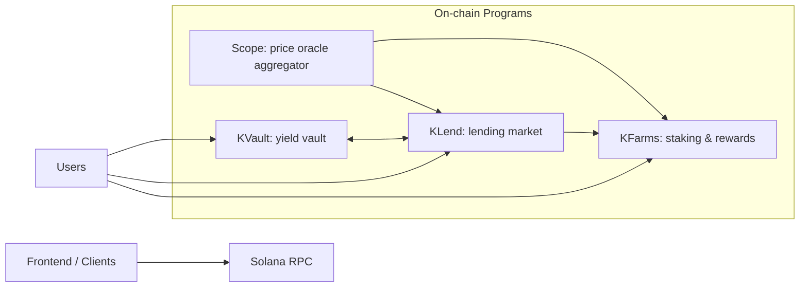

### Kamino Protocol Architecture (KLend, KVault, KFarms, Scope)

This repository implements Kamino’s on-chain lending, vaults, staking, and oracle aggregation on Solana (Anchor-based Rust). This expanded document includes a comprehensive mental model, invariants, trust boundaries, CPIs, and an audit coverage plan.

## Phase 0: Recon & Mental Model

- Program set
  - `kfarms`: staking/farming with rewards, schedule curve, delegated farms, Scope price gating, treasury vaults.
  - `klend`: lending market (reserves, obligations, deposits/borrows, liquidations, flash loans, referral, elevation groups, global config).
  - `kvault`: vault over `klend` reserves; issues shares, allocates capital across reserves, charges management/performance fees; CPIs into `klend`.
  - `scope`: oracle aggregator with mappings, prices, TWAP/EMA; adapters for Pyth, Switchboard, Chainlink, LP oracles; produces `DatedPrice`.

- Entry points and authority/upgrade model
  - `kfarms`: program id declared; global and farm admins; delegated operations via `delegated_authority` and `second_delegated_authority`. Uses Scope price gating.
  - `klend`: program id declared; market owner/authority PDA (lending market authority, LMA); global config PDA; elevation groups; emergency mode gating via constraints.
  - `kvault`: program id declared; per-vault `base_vault_authority` PDA; allocation admin and vault admin; fee fields; CPIs to klend.
  - `scope`: program id via `program_id.rs`; config zero-copy account; oracles mappings/prices/twaps, token metadatas, mint-to-scope-chain PDAs.

- Critical invariants
  - `kfarms`:
    - Rewards issuance via `RewardScheduleCurve`; monotonic timestamp constraints.
    - Reward-per-share and user tallies in `Decimal` scaled u128; safe arithmetic.
    - Deposit caps optionally price-adjusted via Scope; token-2022 feature restrictions; no unexpected remaining accounts.
    - Delegated farms: stake amounts set by external authority (e.g., KLend); cooldown/lockup semantics; slashing accounting.
  - `klend`:
    - Reserve accounting: liquidity supply vs collateral mint/burn; utilization and interest accrual; config integrity validation; withdrawal caps.
    - TWAP/price validity; emergency mode gating; elevation groups constraints.
    - Flash loans: borrow/repay pairing and CPI limitations; fee accounting.
  - `kvault`:
    - AUM computation excludes pending fees; issuance/burn of shares consistent with AUM; allocation weights and caps; min deposit/withdraw; invest cadence; reserve staleness checks; CPI signer seeds correctness.
  - `scope`:
    - Mappings define per-index price sources/types and TWAP enablement; TWAP/EMA tracked; staleness/confidence checks; indices bounds; PDA seeds for mint-to-scope-chain.

- Trust boundaries and CPIs
  - `klend` -> `kfarms`: initialize delegated farms/users, set delegated stake.
  - `kvault` -> `klend`: deposit collateral, redeem collateral, refresh reserves (batch); signs via `base_vault_authority`.
  - `kfarms` -> SPL Token (and Token2022 where allowed): transfer/mint with `transfer_checked` and strict extension checks.
  - `klend`/`kvault` -> token interface: `mint/burn/transfer_checked` with mint decimals and signer seeds.
  - `scope` ingests external oracle accounts and exposes read-only prices.

- External deps
  - DEX/LP: Whirlpool, Raydium, Jupiter LP, Meteora DLMM (through `scope` oracle adapters).
  - Oracles: Pyth (pull/ema/lazer), Switchboard V2/On-demand, Chainlink, Redstone.
  - Token-2022: strict extension whitelist; transfer fee must be zero; no transfer hook program id; pausable not paused; initialized state.

- Math/precision stack
  - `kfarms`: `decimal_wad::Decimal` scaled u128 for stake and reward-per-share.
  - `klend`: `Fraction` fixed-point; borrow rate curve; interest compounding; price adapters; ceil/floor discipline.
  - `kvault`: `Fraction` for AUM, fees, allocations; iterative proportional allocation with caps.
  - `scope`: `Decimal` for price conversions, Q64.64 math; confidence checks.

- Sysvar/compute assumptions
  - Instruction sysvar used by `klend` flash checks; compute-heavy paths: reserve/obligation refreshes, invest loops, liquidation; batch refresh to optimize.

## Phase 1: Audit Plan & Coverage

- Objectives and success criteria
  - `kvault`: verify share math, fee accrual, allocation logic, CPI correctness to `klend`, authorities/signers, withdrawal correctness, `AUM >= pending_fees` invariant, min amounts, metadata ops.
  - `klend`: validate reserve accounting, interest/fees, collateral/borrow limits, liquidation and flash constraints, oracle validation, elevation groups, emergency gating, CPI blocking where expected.
  - `scope`: validate price mapping lifecycle, price freshness/confidence/TWAP, external oracle integrations, bounded parsing, PDA seeds, admin workflows.
  - `kfarms`: validate stake/reward issuance math, locking/penalty, delegated stake flows, deposit caps with Scope price gating, token extension restrictions, vault authorities.

- Impact surface to cover
  - Accounts/PDAs (enumerated in smartcontract.md): seeds, layouts, paddings, sizes, ownerships.
  - Instruction schemas: full list for each program; per-instruction constraints and effects.
  - CPI call graph; token flows (user <-> vaults <-> reserves/farms); math and precision; economics (LTV, liquidation bonuses, elevation groups); oracles (staleness/confidence/TWAP); access control and upgradeability; sysvars and compute.

### High-level Components Map



### Sequence: Vault-Driven Allocation

```mermaid
sequenceDiagram
  participant U as User
  participant V as KVault
  participant L as KLend
  participant S as Scope
  U->>V: deposit(max_amount)
  V->>L: refresh_reserves_batch(skip_price_updates=true)
  V->>V: charge_fees; compute AUM; mint shares
  Note over V: invest loop allocates by weights with caps; crank funds cover rounding
  V->>L: deposit_reserve_liquidity / redeem_reserve_collateral (per target)
  V-->>U: withdraw(shares) returns tokens from available+redeems
```

### Program IDs
- KLend mainnet: `KLend2g3cP87fffoy8q1mQqGKjrxjC8boSyAYavgmjD`
- KVault mainnet: `KvauGMspG5k6rtzrqqn7WNn3oZdyKqLKwK2XWQ8FLjd`

### Security/Invariant Highlights (condensed)
- Price freshness; reserve staleness prevents operations; AUM never below pending fees; strict ceil/floor for conversions; minimum fees and amounts; flash borrow/repay pairing enforcement; token-2022 extension restrictions.

See `smartcontract.md` for per-instruction details, `userflows.md` for operational flows, and `math.md` for formulae with rounding semantics.
