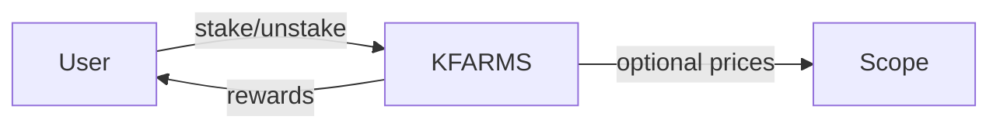
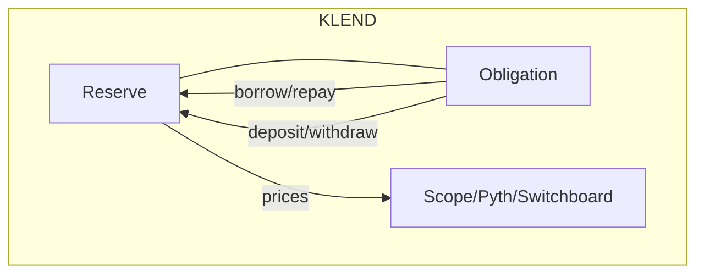
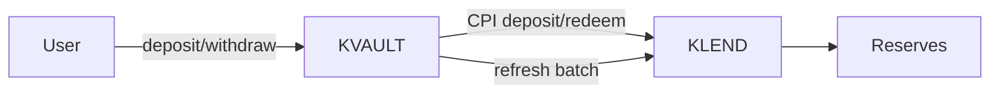
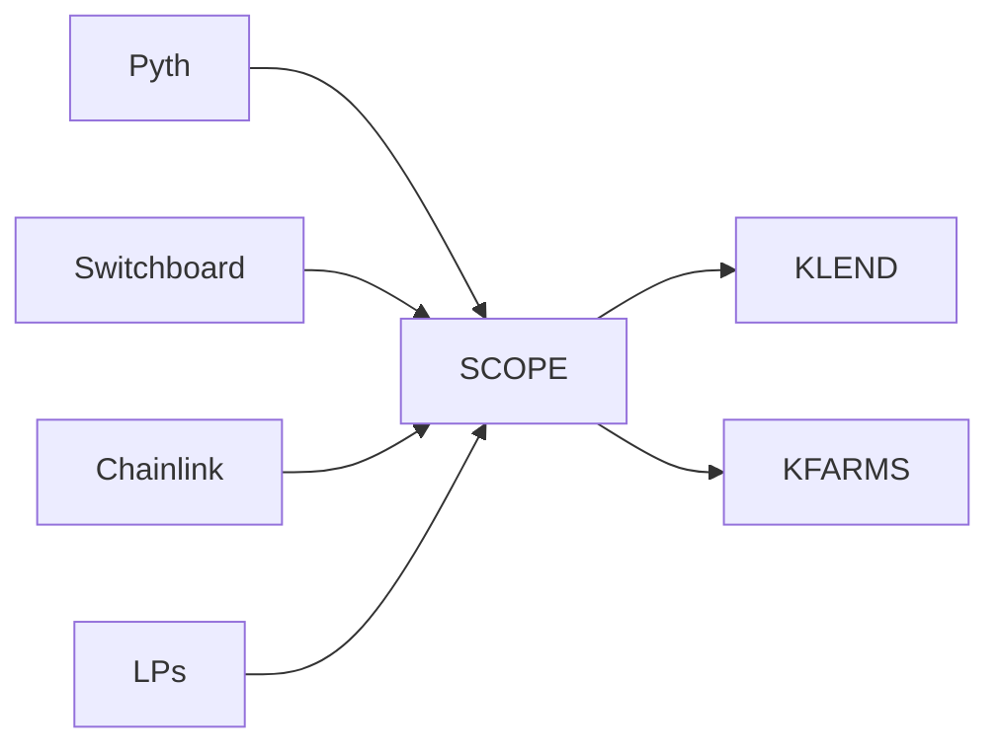

### Smart Contracts and Components Documentation

This document summarizes each on-chain program, its key accounts/PDAs, instruction handlers (with contexts and constraints), and cross-program interactions, with diagrams. It is designed for exhaustive coverage to support audits.

## KFarms (staking/rewards)

- Purpose: Generic staking farm with rewards per time unit, optional lockups and early withdrawal penalties; supports delegated farms controlled by another program; optional Scope price gating.

- Core accounts and PDAs (see `state.rs` and `utils/consts.rs`):
  - `GlobalConfig` (PDA; size ~2136)
  - `FarmState` (PDA; size ~8336)
  - `UserState` (PDA; size ~920)
  - Seeds: `fvault`, `rvault`, `tvault`, `authority`, `user`

- Token operations: SPL and Token-2022 via `token_interface`, all transfers use `transfer_checked` with mint decimals; token-2022 features are whitelisted and disallowed otherwise (transfer fee must be zero; no transfer hook program id; pausable not paused; default account state initialized).

- Constraints/guards: `utils/constraints.rs` enforces no unexpected remaining accounts; price gating via Scope in `FarmState::can_accept_deposit` using staleness and max age.

- Instruction handlers (contexts in `programs/kfarms/src/handlers/`):
  - `initialize_global_config: Context<InitializeGlobalConfig>`
  - `update_global_config: Context<UpdateGlobalConfig>` (mode u8, value [u8;32])
  - `initialize_farm: Context<InitializeFarm>`
  - `initialize_farm_delegated: Context<InitializeFarmDelegated>`
  - `initialize_reward: Context<InitializeReward>`
  - `add_reward: Context<AddReward>` (amount u64, reward_index u64)
  - `update_farm_config: Context<UpdateFarmConfig>` (mode u16, data Vec<u8>)
  - `initialize_user: Context<InitializeUser>`
  - `transfer_ownership: Context<TransferOwnership>`
  - `reward_user_once: Context<RewardUserOnce>` (reward_index u64, amount u64)
  - `refresh_farm: Context<RefreshFarm>`
  - `stake: Context<Stake>` (amount u64)
  - `set_stake_delegated: Context<SetStakeDelegated>` (new_amount u64)
  - `harvest_reward: Context<HarvestReward>` (reward_index u64)
  - `unstake: Context<Unstake>` (stake_shares_scaled u128)
  - `refresh_user_state: Context<RefreshUserState>`
  - `withdraw_unstaked_deposits: Context<WithdrawUnstakedDeposits>`
  - `withdraw_treasury: Context<WithdrawTreasury>` (amount u64)
  - `deposit_to_farm_vault: Context<DepositToFarmVault>` (amount u64)
  - `withdraw_from_farm_vault: Context<WithdrawFromFarmVault>` (amount u64)
  - `withdraw_slashed_amount: Context<WithdrawSlashedAmount>`
  - `update_farm_admin: Context<UpdateFarmAdmin>`
  - `update_global_config_admin: Context<UpdateGlobalConfigAdmin>`
  - `withdraw_reward: Context<WithdrawReward>` (amount u64, reward_index u64)
  - `update_second_delegated_authority: Context<UpdateSecondDelegatedAuthority>`
  - `idl_missing_types: Context<UpdateGlobalConfig>` (sentinel)

- Diagram


## KLend (lending market)

- Purpose: Lending protocol with reserves, obligations, deposit/redeem collateral, borrow/repay, flash loans, liquidations, referrals, elevation groups, global config, and delegated farm integration.

- State accounts and PDAs (see `state/`, `utils/seeds.rs`):
  - `LendingMarket`, `Reserve`, `Obligation`, `GlobalConfig`, `Referral`, `TokenInfo`, `LastUpdate`, `ObligationOrder` (+ nested types)
  - PDAs: LMA (`lending_market_authority`), reserve liquidity supply vault, reserve collateral mint and supply, fee receiver, global config, referral/user metadata PDAs, program_data

- Constraints/guards: `utils/constraints.rs` enforces `emergency_mode_disabled`, validates no unexpected remaining accounts; token-2022 validations for liquidity tokens; comprehensive price validation (staleness, twap divergence, confidence bounds, zero and heuristic checks) in `utils/prices/*`.

- Token CPIs: `utils/token_transfer.rs` centralizes SPL transfers/mint/burn/transfer_checked for all flows.

- Farms CPIs: `lending_market/farms_ixs.rs` integrates delegated farms (`kfarms`) for per-reserve staking.

- Instruction handlers (selected; contexts in `handlers/`, logic in `lending_market/lending_operations.rs` and submodules):
  - Market and config: `init_lending_market`, `update_lending_market`, `update_lending_market_owner`, `init_global_config`, `update_global_config`, `update_global_config_admin`
  - Reserve lifecycle: `init_reserve`, `refresh_reserve`, `refresh_reserves_batch(skip_price_updates)`, `update_reserve_config`, `redeem_fees`, `withdraw_protocol_fees`
  - Obligation lifecycle: `init_obligation(args)`, `refresh_obligation(_deposits/_borrows)`, `set_obligation_order`, `request_elevation_group`
  - User operations:
    - Deposits: `deposit_reserve_liquidity`, `redeem_reserve_collateral`
    - Collateral in obligation: `deposit_obligation_collateral`, `withdraw_obligation_collateral`
    - Borrow/repay: `borrow_obligation_liquidity`, `repay_obligation_liquidity`, combos: `repay_and_withdraw_redeem`, `deposit_and_withdraw`, `deposit_reserve_liquidity_and_obligation_collateral`, `withdraw_obligation_collateral_and_redeem_reserve_collateral`
  - Liquidation/deleveraging: `liquidate_obligation_and_redeem_reserve_collateral`, `mark_obligation_for_deleveraging`, deleveraging order execution
  - Flash loans: `flash_borrow_reserve_liquidity`, `flash_repay_reserve_liquidity` (enforced same-tx pair, CPI forbidden)
  - Referral: `init_referrer_state`, `init_referrer_token_state`, `withdraw_referrer_fees`, user metadata and short URL mgmt

- Diagram


## KVault (yield vault over KLend)

- Purpose: Tokenized vault allocating a single-asset deposit across multiple KLend reserves; mints/burns shares; charges mgmt/perf fees; rebalances toward target weights and caps; CPIs into KLend.

- Accounts and PDAs:
  - `VaultState` (zero-copy): admin keys, token mint/vault, shares mint, accounting (token_available, shares_issued), fee params and accumulators, allocation strategy array of `VaultAllocation`.
  - `VaultAllocation` (zero-copy): reserve pubkey, ctoken vault, target weight, token cap, ctoken balances, last invest slot.
  - Seeds: `token_vault`, `ctoken_vault`, `BASE_VAULT_AUTHORITY_SEED` (base_vault_authority), shares mint, metadata

- Instruction handlers (`programs/kvault/src/lib.rs`):
  - `init_vault`
  - `update_reserve_allocation(weight, cap)` / `remove_allocation`
  - `deposit(max_amount)` / `withdraw(shares_amount)` / `withdraw_from_available(shares_amount)`
  - `invest()` (per reserve)
  - `withdraw_pending_fees` / `give_up_pending_fees(max_amount_to_give_up)`
  - `update_vault_config(entry, data)`, `update_admin`, shares metadata init/update

- CPIs to KLend (`operations/klend_operations.rs`): `RefreshReservesBatch`, `DepositReserveLiquidity`, `RedeemReserveCollateral` signed by `base_vault_authority` seeds.

- Diagram


## Scope (oracle aggregator)

- Purpose: Oracle aggregator copying/validating prices into unified price feeds; adapters for Pyth EMA, Switchboard, Chainlink, LP pools, jito_restaking, securitize, etc.; maintains TWAP/EMA if enabled.

- Accounts and PDAs (see `programs/scope/src/states.rs`, `utils/pdas.rs`):
  - `Configuration`, `OracleMappings`, `OraclePrices`, `OracleTwaps`, `TokenMetadatas`, `MintsToScopeChains`
  - Seeds: `conf`, `mints_to_scope_chains` with `[seed_pk, seed_id, bump]`, and price/TWAP seeds by indexes.

- Core handlers (`programs/scope/src/handlers/`):
  - `initialize(feed_name)`
  - `refresh_prices` and specialized: `refresh_chainlink_price`, `refresh_pyth_lazer_price`
  - `update_mapping(token, price_type, twap_enabled, twap_source, ref_price_index, feed_name, generic_data[20])`
  - `reset_twap(token, feed_name)`, `update_token_metadata(index, mode, feed_name, value)`, `set_admin_cached`, `approve_admin_cached`
  - Mint mapping lifecycle: `create_mint_map(seed_pk, seed_id, bump, scope_chains)`, `close_mint_map`

- Diagram


## Cross-program edges (CPIs)
- `kvault` -> `klend`: refresh, deposit, redeem; shares mint/burn local to `kvault`.
- `klend` -> `kfarms`: init farm/user delegated, set stake delegated.
- `kfarms`/`klend` -> SPL/SPL-2022: transfer/mint/burn checked with decimals; strict extension validation.
- `scope` reads external oracle accounts; exposes read-only price feeds, no token transfers.

Refer to `math.md` for detailed formula derivations and rounding rules per function, and to `userflows.md` for flow-level diagrams including flash loans, liquidation, and deleveraging.

## KLend: Per-file Handler Coverage (handlers/)

- handler_borrow_obligation_liquidity.rs
  - Entrypoints: process_v1, process_v2 → process_impl
  - Validations: borrow checks (owner, market authority PDA, reserve ties), refresh hints, referrer token state validation
  - Effects: calls lending_operations::borrow_obligation_liquidity; transfers origination fee to fee_vault and receive_amount to user; post-transfer reserve balance checks
- handler_delete_referrer_state_and_short_url.rs
  - Deletes referrer state and short URL PDAs; authority checks; cleans up referral mappings
- handler_deposit_and_withdraw.rs
  - Combo: deposit_reserve_liquidity and withdraw_obligation_collateral in one ix; validates both sides and ordering; minimizes round trips
- handler_deposit_obligation_collateral.rs
  - Deposits cTokens into Obligation; elevation group checks; updates elevation debt trackers on new deposit; calls lending_operations::deposit_obligation_collateral
- handler_deposit_reserve_liquidity_and_obligation_collateral.rs
  - Combo: deposit liquidity to reserve then deposit collateral into obligation in one ix; enforces all checks; transfers both token legs
- handler_deposit_reserve_liquidity.rs
  - Validations and refresh; calls lending_operations::deposit_reserve_liquidity; transfers user liquidity to reserve supply and mints collateral to user; post-transfer checks
- handler_flash_borrow_reserve_liquidity.rs
  - Validations including sysvar instructions; flash_borrow_checks; refresh; lending_operations::flash_borrow_reserve_liquidity; token transfer to user
- handler_flash_repay_reserve_liquidity.rs
  - Validations including sysvar inspection; flash_repay_checks; lending_operations::flash_repay_reserve_liquidity; transfers back from user to reserve
- handler_init_farms_for_reserve.rs
  - CPIs into kfarms to initialize collateral/debt farms for a reserve; authority checks; sets farm pubkeys on Reserve
- handler_init_global_config.rs
  - Initializes GlobalConfig PDA; sets initial parameters (fees, toggles, thresholds)
- handler_init_lending_market.rs
  - Initializes LendingMarket and LMA PDA; sets quote currency, owner, bumps
- handler_init_obligation_farms_for_reserve.rs
  - Initializes obligation-level farm links for reserve staking rewards; optional
- handler_init_obligation.rs
  - Initializes Obligation for a user; sets owner, market, tag/id
- handler_init_referrer_state_and_short_url.rs
  - Initializes referrer mapping and short URL PDAs; ties to referrer key
- handler_init_referrer_token_state.rs
  - Initializes per-token referrer state (fees accrual for given liquidity mint)
- handler_init_reserve.rs
  - Initializes Reserve with liquidity/collateral config; sets vaults/mints; borrow curve; limits; token_info
- handler_init_user_metadata.rs
  - Initializes per-user metadata PDA for referrals/UX
- handler_liquidate_obligation_and_redeem_reserve_collateral.rs
  - Validates liquidation; calls liquidation math; settles debt; redeems collateral; transfers accordingly; applies protocol fee
- handler_mark_obligation_for_deleveraging.rs
  - Marks obligation for individual deleveraging with target LTV and timestamp
- handler_redeem_fees.rs
  - Calls lending_operations::redeem_fees to withdraw protocol fees from reserve fee_vault to receiver
- handler_redeem_reserve_collateral.rs
  - Redeems cTokens to liquidity from reserve; with optional withdrawal cap accounting; transfers to user
- handler_refresh_obligation_farms_for_reserve.rs
  - Refreshes obligation farms state for a specific reserve
- handler_refresh_obligation.rs
  - Recomputes obligation values; validates assets; marks last_update stale as needed
- handler_refresh_reserve.rs
  - Accrues interest, updates price optionally, sets last_update; writes price status
- handler_refresh_reserves_batch.rs
  - Batch refresh of multiple reserves; optional skip price updates; efficiency path for cranks
- handler_repay_and_withdraw_redeem.rs
  - Combined repay and withdraw/redeem path to reduce round trips and races
- handler_repay_obligation_liquidity.rs
  - Validations; accrues interest; calls lending_operations::repay_obligation_liquidity; token transfers from user to reserve; post checks
- handler_request_elevation_group.rs
  - Requests elevation group for obligation; validates limits and updates trackers
- handler_set_obligation_order.rs
  - Sets liquidation/deleveraging order on obligation; validates ranges and supported conditions/opportunities
- handler_socialize_loss.rs
  - Socializes bad debt across depositors per config; reduces claims uniformly; logs
- handler_update_global_config_admin.rs
  - Admin transfer for GlobalConfig
- handler_update_global_config.rs
  - Mutates global config fields by mode with value payloads; integrity checks
- handler_update_lending_market_owner.rs
  - Transfers market owner to new pubkey
- handler_update_lending_market.rs
  - Updates lending market fields by mode; validates via config_items renderings/validations
- handler_update_reserve_config.rs
  - Updates reserve config by mode; runs integrity validation; respects admin scopes
- handler_withdraw_obligation_collateral_and_redeem_reserve_collateral.rs
  - Combined withdraw collateral from obligation and redeem to liquidity in one ix
- handler_withdraw_obligation_collateral.rs
  - Validations and allowed amount computation; updates obligation; elevation trackers on full withdraw
- handler_withdraw_protocol_fees.rs
  - Withdraws protocol fees from market-level fee receiver (if applicable)
- handler_withdraw_referrer_fees.rs
  - Withdraws accrued referrer fees for a referrer token state; validates allowances

## KLend: Lending Market Modules

- config_items.rs: enum of update modes, (de)serialization helpers, validations and renderings of config changes
- farms_ixs.rs: CPIs to KFarms to initialize and manage delegated farms, set stakes
- flash_ixs.rs: instruction sysvar inspection and pair validation for flash borrow/repay; erroring on CPI calls and duplicates
- ix_utils.rs: instruction loader, iterators over instructions, utility helpers
- lending_checks.rs: pre/post validations for each handler (account constraints, ownership, amounts, statuses)
- lending_operations.rs: core math and state mutation for refresh, deposit, borrow, repay, redeem, liquidation, etc.
- withdrawal_cap_operations.rs: moving-average style caps with timestamp windows for deposits/borrows

## KLend: State Modules

- global_config.rs: protocol-wide toggles, fee bps, thresholds, feature gates
- last_update.rs: freshness tracking, staleness/price status flags
- lending_market.rs: market metadata, owner/bump, referrals settings, elevation group registry
- liquidation_operations.rs: liquidation math and selection logic
- nested_accounts.rs: typed nested account structs for handlers
- obligation.rs: user positions (collaterals, borrows), LTV math, orders, markers
- order_operations.rs: order evaluation (conditions/opportunities) and consumption
- referral.rs: referral state and amounts unclaimed tracking
- reserve.rs: liquidity/collateral accounting, borrow curve application, interest accrual, fees, limits
- token_info.rs: token metadata and decimal factors, max age
- types.rs: shared types and results structs

## KLend: Utils

- prices/*: oracle adapters and validation (pyth, switchboard, scope), confidence/age checks
- account_loader_trait.rs, account_ops.rs, accounts.rs: account loading and ops
- borrow_rate_curve.rs: piecewise rate function
- constraints.rs: program-wide invariants and guards
- consts.rs: constants (SLOTS_PER_YEAR, etc.)
- fraction.rs: fixed-point Fraction math
- macros.rs: logging and helper macros
- refresh_ix_utils.rs: helpers for refresh batching
- secs.rs, seeds.rs: time/seed utilities
- spltoken.rs, token_transfer.rs: token ops for SPL/SPL-2022 with checks
- validation.rs: additional validators

## KFarms: Per-file Handler Coverage (handlers/)

- initialize_global_config.rs: create global config; admin set
- update_global_config.rs: mutate global config fields
- initialize_farm.rs / initialize_farm_delegated.rs: set up farm state; delegated authority wiring
- initialize_reward.rs: allocate reward slot; set mint/decimals and vaults
- add_reward.rs: fund reward vault accounting
- initialize_user.rs: open user state; user_id assignment
- refresh_farm.rs / refresh_user_state.rs: recompute rewards and stake state based on timestamps
- stake.rs / unstake.rs: add/remove (pending) stakes; apply warmup/cooldown and penalties; update tallies
- harvest_reward.rs: move issued unclaimed rewards to user, split treasury fee
- set_stake_delegated.rs: delegated stake adjustments
- transfer_ownership.rs: farm admin changes
- update_farm_admin.rs / update_second_delegated_authority.rs: admin keys
- update_farm_config.rs: mutate farm fields including rps, schedule curve points, locks, caps, scope linkage
- withdraw_unstaked_deposits.rs: withdraw after cooldown lapse
- withdraw_from_farm_vault.rs: proportional withdraw from farm vault (active+pending)
- withdraw_reward.rs: withdraw rewards from reward vault by admin
- withdraw_slashed_amount.rs / withdraw_treasury.rs: admin flows

## KFarms: Core Modules

- farm_operations.rs: business logic for stake/rewards issuance, config updates
- stake_operations.rs: stake/unstake math including penalties
- state.rs: zero-copy farm/user/reward state and helpers
- token_operations.rs: SPL transfers and checked operations
- utils/*: constraints, math, scope price access, macros, accessors
- types.rs: effect/result structs used by handlers

## KVault: Per-file Handler Coverage (handlers/)

- handler_init_vault.rs: initializes vault; validates token/shares mints; seeds
- handler_update_reserve_allocation.rs / handler_remove_allocation.rs: upsert/remove allocation entries and caps/weights
- handler_deposit.rs / handler_withdraw.rs / handler_withdraw_pending_fees.rs / handler_give_up_pending_fees.rs: user flows for shares mint/burn and fee handling
- handler_invest.rs: per-reserve invest/disinvest according to targets and cadence
- handler_update_vault_config.rs / handler_update_admin.rs: config and admin updates
- handler_initialize_shares_metadata.rs / handler_update_metadata.rs: Metaplex metadata
- handler_withdraw_from_available.rs: withdraw only from available balance

## KVault: Core Modules

- operations/vault_operations.rs: vault math (AUM, shares, fees, allocations, invest/withdraw effects)
- operations/klend_operations.rs: CPIs to KLend with proper signer seeds
- operations/vault_checks.rs: preconditions (staleness, amounts)
- operations/effects.rs: typed effects of operations
- state.rs: zero-copy `VaultState` and `VaultAllocation` with helpers
- utils/*: consts, CPIs memory, metadata, token ops, macros
- events.rs: emitted events
- lib.rs: program entrypoints

### KLend Handlers: Line-by-line Annotations (selected)

```1:154:klend/programs/klend/src/handlers/handler_borrow_obligation_liquidity.rs
pub fn process_v1<'info>(...) -> Result<()> {            // v1 entrypoint (legacy account layout)
  check_refresh_ixs!(...);                               // Enforce prior refresh ixs if needed
  process_impl(...)
}
pub fn process_v2<'info>(...) -> Result<()> {            // v2 entrypoint (nested accounts)
  process_impl(&ctx.accounts.borrow_accounts, ...)?;     // Same core logic
  refresh_farms!(...);                                   // Optionally refresh farms rewards
  Ok(())
}
fn process_impl<'info>(accounts, remaining_accounts, liquidity_amount) -> Result<()> {
  msg!("liquidity_amount {}", liquidity_amount);
  lending_checks::borrow_obligation_liquidity_checks(accounts)?; // Precondition checks

  let borrow_reserve = &mut accounts.borrow_reserve.load_mut()?; // Load zero-copy
  let lending_market = &accounts.lending_market.load()?;         // Read-only load
  let obligation = &mut accounts.obligation.load_mut()?;         // Mut obligation
  let lending_market_key = accounts.lending_market.key();
  let clock = &Clock::get()?;                                    // Sysvar clock

  let authority_signer_seeds = gen_signer_seeds!(...);           // LMA signer seeds

  // Build iterator of deposit reserves from remaining accounts
  let deposit_reserves_iter = remaining_accounts.iter()
    .map(|ai| FatAccountLoader::<Reserve>::try_from(ai).unwrap());

  // Optional referrer validation and loader
  let referrer_token_state_option: Option<RefMut<ReferrerTokenState>> = if obligation.has_referrer() {
    match &accounts.referrer_token_state {
      Some(loader) => { let state = loader.load_mut()?; validate_referrer_token_state(...)?; Some(state) }
      None => return err!(LendingError::ReferrerAccountMissing),
    }
  } else { None };

  // Snapshot pre-transfer balances for post checks
  let initial_reserve_token_balance = token_interface::accessor::amount(&accounts.reserve_source_liquidity.to_account_info())?;
  let initial_reserve_available_liquidity = borrow_reserve.liquidity.available_amount;

  // Core math and state mutation
  let CalculateBorrowResult { receive_amount, borrow_fee, .. } =
    lending_operations::borrow_obligation_liquidity(
      lending_market, borrow_reserve, obligation, liquidity_amount, clock,
      accounts.borrow_reserve.key(), referrer_token_state_option, deposit_reserves_iter,
    )?;

  xmsg!("pnl: Borrow obligation liquidity {receive_amount} with borrow_fee {borrow_fee}");

  if borrow_fee > 0 {                                     // Transfer origination fee to fee receiver
    token_transfer::send_origination_fees_transfer(..., borrow_fee, accounts.borrow_reserve_liquidity_mint.decimals)?;
  }

  // Transfer receive_amount from reserve supply to user
  token_transfer::borrow_obligation_liquidity_transfer(..., receive_amount, accounts.borrow_reserve_liquidity_mint.decimals)?;

  // Post-transfer invariants ensure vault and available amounts changed as expected
  lending_checks::post_transfer_vault_balance_liquidity_reserve_checks(
    token_interface::accessor::amount(&accounts.reserve_source_liquidity.to_account_info()).unwrap(),
    borrow_reserve.liquidity.available_amount,
    initial_reserve_token_balance,
    initial_reserve_available_liquidity,
    LendingAction::Subtractive(borrow_fee + receive_amount),
  )?;
  Ok(())
}
``` 

```12:153:klend/programs/klend/src/handlers/handler_flash_repay_reserve_liquidity.rs
pub fn process(ctx, liquidity_amount, borrow_instruction_index) -> Result<()> {
  lending_checks::flash_repay_reserve_liquidity_checks(&ctx)?; // Accounts and auth
  let reserve = &mut ctx.accounts.reserve.load_mut()?;         // Load reserve
  let lending_market = &ctx.accounts.lending_market.load()?;

  // Pre-transfer snapshot
  let initial_reserve_token_balance = token_interface::accessor::amount(&ctx.accounts.reserve_destination_liquidity.to_account_info())?;
  let initial_reserve_available_liquidity = reserve.liquidity.available_amount;

  // Ensure matching flash borrow earlier in the same TX, accounts equal, same amount
  flash_ixs::flash_repay_checks(&ctx, borrow_instruction_index, liquidity_amount)?;

  // Optional referrer validation if provided
  let referrer_token_state_loader = if referrer_account.is_some() { ... } else { None };

  // Compute repay amounts (may include referrer fee and protocol origination fee)
  let (flash_loan_amount_with_referrer_fee, reserve_origination_fee) = lending_operations::flash_repay_reserve_liquidity(
    lending_market, reserve, liquidity_amount, u64::try_from(Clock::get()?.unix_timestamp).unwrap(), referrer_token_state_loader,
  )?;

  // Transfer repay from user to reserve
  token_transfer::repay_obligation_liquidity_transfer(..., flash_loan_amount_with_referrer_fee, ctx.accounts.reserve_liquidity_mint.decimals)?;

  // Pay origination fee to fee receiver if applicable
  if reserve_origination_fee > 0 {
    token_transfer::pay_borrowing_fees_transfer(..., reserve_origination_fee, ctx.accounts.reserve_liquidity_mint.decimals)?;
  }

  // Post-transfer checks (additive since liquidity returns to reserve)
  lending_checks::post_transfer_vault_balance_liquidity_reserve_checks(
    token_interface::accessor::amount(&ctx.accounts.reserve_destination_liquidity.to_account_info()).unwrap(),
    reserve.liquidity.available_amount,
    initial_reserve_token_balance,
    initial_reserve_available_liquidity,
    LendingAction::Additive(flash_loan_amount_with_referrer_fee),
  )?;
  Ok(())
}
```

```19:136:klend/programs/klend/src/handlers/handler_redeem_reserve_collateral.rs
pub fn process(ctx, collateral_amount) -> Result<()> {
  lending_checks::redeem_reserve_collateral_checks(&RedeemReserveCollateralAccounts { ... })?; // Structured checks

  let reserve = &mut ctx.accounts.reserve.load_mut()?;    // Load state
  let lending_market = &ctx.accounts.lending_market.load()?;
  let clock = Clock::get()?;                              // Slot/time

  let authority_signer_seeds = gen_signer_seeds!(...);

  // Snapshot for post checks
  let initial_reserve_token_balance = token_interface::accessor::amount(&ctx.accounts.reserve_liquidity_supply.to_account_info())?;
  let initial_reserve_available_liquidity = reserve.liquidity.available_amount;

  // Refresh reserve (accrue interest) then redeem
  lending_operations::refresh_reserve(reserve, &clock, None, lending_market.referral_fee_bps)?;
  let withdraw_liquidity_amount = lending_operations::redeem_reserve_collateral(reserve, collateral_amount, &clock, true)?;

  // Token CPIs: burn collateral from user; mint/transfer liquidity to user
  token_transfer::redeem_reserve_collateral_transfer(..., collateral_amount, withdraw_liquidity_amount, ctx.accounts.reserve_liquidity_mint.decimals)?;

  // Post checks (subtractive from reserve supply since liquidity leaves)
  lending_checks::post_transfer_vault_balance_liquidity_reserve_checks(
    token_interface::accessor::amount(&ctx.accounts.reserve_liquidity_supply.to_account_info()).unwrap(),
    reserve.liquidity.available_amount,
    initial_reserve_token_balance,
    initial_reserve_available_liquidity,
    LendingAction::Subtractive(withdraw_liquidity_amount),
  )?;
  Ok(())
}
```

```19:139:klend/programs/klend/src/handlers/handler_deposit_obligation_collateral.rs
pub fn process_v1(..) -> Result<()> { check_refresh_ixs!(..); process_impl(..) }
pub fn process_v2(..) -> Result<()> { process_impl(..)?; refresh_farms!(..); Ok(()) }
fn process_impl(accounts, collateral_amount) -> Result<()> {
  lending_checks::deposit_obligation_collateral_checks(&...)?;    // Structured account/amount checks
  let clock = Clock::get()?;                                       // Current slot
  let lending_market = &accounts.lending_market.load()?;
  let deposit_reserve = &mut accounts.deposit_reserve.load_mut()?; // Mut reserve
  let obligation = &mut accounts.obligation.load_mut()?;           // Mut obligation

  lending_operations::refresh_reserve(deposit_reserve, &clock, None, lending_market.referral_fee_bps)?; // Accrue interest
  lending_operations::deposit_obligation_collateral(
    lending_market, deposit_reserve, obligation, clock.slot, collateral_amount,
    accounts.deposit_reserve.key(), MaxReservesAsCollateralCheck::Perform,
  )?;                                                               // Math + state updates

  token_transfer::deposit_obligation_collateral_transfer(..., collateral_amount)?; // Token move
  Ok(())
}
```

```18:146:klend/programs/klend/src/handlers/handler_withdraw_obligation_collateral.rs
pub fn process_v1(..) -> Result<()> { check_refresh_ixs!(..); process_impl(..) }
pub fn process_v2(..) -> Result<()> { process_impl(..)?; refresh_farms!(..); Ok(()) }
fn process_impl(accounts, collateral_amount) -> Result<()> {
  let close_obligation = {
    lending_checks::withdraw_obligation_collateral_checks(&...)?;  // Preconditions
    let clock = &Clock::get()?;
    let withdraw_reserve = &mut accounts.withdraw_reserve.load_mut()?;
    let obligation = &mut accounts.obligation.load_mut()?;
    let lending_market = &mut accounts.lending_market.load()?;

    let withdraw_amount = lending_operations::withdraw_obligation_collateral(
      lending_market, withdraw_reserve, obligation, collateral_amount,
      clock.slot, accounts.withdraw_reserve.key(), LtvMaxWithdrawalCheck::MaxLtv,
    )?;                                                             // Computes allowed amount

    let authority_signer_seeds = gen_signer_seeds!(..);
    token_transfer::withdraw_obligation_collateral_transfer(
      accounts.token_program.to_account_info(),
      accounts.user_destination_collateral.to_account_info(),
      accounts.reserve_source_collateral.to_account_info(),
      accounts.lending_market_authority.clone(), authority_signer_seeds, withdraw_amount,
    )?;                                                             // Move tokens

    msg!("pnl: Withdraw obligation collateral {}", withdraw_amount);
    obligation.active_deposits_empty() && obligation.active_borrows_empty() // Decide auto-close
  };
  close_account_loader(close_obligation, &accounts.owner, &accounts.obligation)?; // Optionally close
  Ok(())
}
```

```11:85:klend/programs/klend/src/handlers/handler_refresh_reserve.rs
pub fn process(ctx) -> Result<()> {
  let clock = &Clock::get()?;                     // Time
  let reserve = &mut ctx.accounts.reserve.load_mut()?;
  let lending_market = &ctx.accounts.lending_market.load()?;

  constraints::check_remaining_accounts(&ctx)?;   // No unexpected RAs
  require!(reserve.version == PROGRAM_VERSION as u64, LendingError::ReserveDeprecated);

  let price_res = if lending_operations::is_price_refresh_needed(reserve, lending_market, clock.unix_timestamp) {
    reserve.config.token_info.validate_token_info_config(..)?;     // Ensure right oracle set
    get_price(&reserve.config.token_info, .., clock)?              // Fetch price
  } else { None };

  lending_operations::refresh_reserve(reserve, clock, price_res, lending_market.referral_fee_bps)?; // Accrue + set price
  lending_operations::refresh_reserve_limit_timestamps(reserve, u64::try_from(clock.unix_timestamp).unwrap());
  msg!("Token: {} Price: {}", reserve.config.token_info.symbol(), reserve.liquidity.get_market_price().to_display());
  Ok(())
}
```

```26:129:klend/programs/klend/src/handlers/handler_refresh_reserves_batch.rs
pub fn process(ctx, skip_price_updates) -> Result<()> {
  let clock = &Clock::get()?;                     // Time
  let mut it = ctx.remaining_accounts.iter();
  loop {
    let Some(reserve_acc) = it.next() else { break };              // Reserve
    let Some(lending_market_acc) = it.next() else { ... }           // Market
    let reserve_loader = FatAccountLoader::<Reserve>::try_from(reserve_acc)?;
    let reserve = &mut reserve_loader.load_mut()?;

    require_keys_eq!(reserve.lending_market, *lending_market_acc.key, LendingError::InvalidAccountInput);
    let lending_market_loader = FatAccountLoader::<LendingMarket>::try_from(lending_market_acc)?;
    let lending_market = &lending_market_loader.load()?;

    require!(lending_market.emergency_mode == false as u8, LendingError::GlobalEmergencyMode);
    require!(reserve.version == PROGRAM_VERSION as u64, LendingError::ReserveDeprecated);

    let price_res = if !skip_price_updates {                    // Optionally pass price
      let pyth = maybe_price_account(it.next())?;               // Each optional account validated
      let sb_price = maybe_price_account(it.next())?;
      let sb_twap = maybe_price_account(it.next())?;
      let scope = maybe_price_account(it.next())?;
      if lending_operations::is_price_refresh_needed(reserve, lending_market, clock.unix_timestamp) {
        reserve.config.token_info.validate_token_info_config(pyth, sb_price, sb_twap, scope)?;
        get_price(&reserve.config.token_info, pyth, sb_price, sb_twap, scope, clock)?
      } else { None }
    } else { None };

    lending_operations::refresh_reserve(reserve, clock, price_res, lending_market.referral_fee_bps)?;
    lending_operations::refresh_reserve_limit_timestamps(reserve, u64::try_from(clock.unix_timestamp).unwrap());

    if !skip_price_updates { msg!("Token: {} Price: {}", reserve.config.token_info.symbol(), reserve.liquidity.get_market_price().to_display()); }
  }
  Ok(())
}
```

```18:166:klend/programs/klend/src/handlers/handler_repay_obligation_liquidity.rs
pub(super) fn process_impl(accounts, remaining_accounts_it, liquidity_amount) -> Result<()> {
  lending_checks::repay_obligation_liquidity_checks(accounts)?;  // Structured checks
  let clock = Clock::get()?;
  let repay_reserve = &mut accounts.repay_reserve.load_mut()?;   // Mut state
  let obligation = &mut accounts.obligation.load_mut()?;
  let lending_market = &accounts.lending_market.load()?;

  let initial_reserve_token_balance = token_interface::accessor::amount(&accounts.reserve_destination_liquidity.to_account_info())?;
  let initial_reserve_available_liquidity = repay_reserve.liquidity.available_amount;

  let repay_amount = lending_operations::repay_obligation_liquidity(
    repay_reserve, obligation, &clock, liquidity_amount, accounts.repay_reserve.key(),
    lending_market, remaining_accounts_it.map(|a| FatAccountLoader::try_from(a).expect("...")),
  )?;                                                            // Math + state

  xmsg!("pnl: Repaying obligation liquidity {} liquidity_amount {}", repay_amount, liquidity_amount);

  token_transfer::repay_obligation_liquidity_transfer(
    accounts.token_program.to_account_info(), accounts.reserve_liquidity_mint.to_account_info(),
    accounts.user_source_liquidity.to_account_info(), accounts.reserve_destination_liquidity.to_account_info(),
    accounts.owner.to_account_info(), repay_amount, accounts.reserve_liquidity_mint.decimals,
  )?;                                                            // Token move

  lending_checks::post_transfer_vault_balance_liquidity_reserve_checks(
    token_interface::accessor::amount(&accounts.reserve_destination_liquidity.to_account_info()).unwrap(),
    repay_reserve.liquidity.available_amount, initial_reserve_token_balance,
    initial_reserve_available_liquidity, LendingAction::Additive(repay_amount),
  )?;                                                            // Post invariants
  Ok(())
}
```

```24:345:klend/programs/klend/src/handlers/handler_liquidate_obligation_and_redeem_reserve_collateral.rs
pub fn process_v1/v2(..) -> Result<()> {                 // v1 + v2 (with farms refresh)
  check_refresh_ixs!(.., Collateral, Debt);              // Require prior refresh
  process_impl(..)
}
fn process_impl(accounts, remaining_accounts, liquidity_amount, min_recv_liq, max_ltv_override_pct) -> Result<()> {
  xmsg!("Liquidate... amount {} max_allowed_ltv_override_percent {}", liquidity_amount, max_ltv_override_pct);
  lending_checks::liquidate_obligation_checks(accounts)?;         // Structured pre-checks
  lending_checks::redeem_reserve_collateral_checks(&...)?;        // Redeem leg checks

  let lending_market = &accounts.lending_market.load()?;
  let obligation = &mut accounts.obligation.load_mut()?;
  let clock = &Clock::get()?;

  // Optional override only allowed for owner and in staging builds
  let max_allowed_ltv_override_pct_opt = if accounts.liquidator.key() == obligation.owner && max_allowed_ltv_override_percent > 0 {
    if cfg!(feature = "staging") { Some(max_ltv_override_pct) } else { msg!("Warning! ..."); None }
  } else { None };

  // Snapshot balances for post checks
  let initial_withdraw_reserve_token_balance = token::accessor::amount(&accounts.withdraw_reserve_liquidity_supply.to_account_info())?;
  let initial_repay_reserve_token_balance = token::accessor::amount(&accounts.repay_reserve_liquidity_supply.to_account_info())?;
  let (initial_repay_reserve_available_amount, initial_withdraw_reserve_available_amount) =
    lending_checks::initial_liquidation_reserve_liquidity_available_amount(&accounts.repay_reserve, &accounts.withdraw_reserve);

  let authority_signer_seeds = gen_signer_seeds!(..);

  // Core liquidation math
  let LiquidateAndRedeemResult { repay_amount, withdraw_collateral_amount, withdraw_amount, total_withdraw_liquidity_amount, .. } =
    lending_operations::liquidate_and_redeem(
      lending_market, &accounts.repay_reserve, &accounts.withdraw_reserve, obligation, clock,
      liquidity_amount, min_recv_liq, max_allowed_ltv_override_pct_opt,
      remaining_accounts.iter().map(|a| FatAccountLoader::try_from(a).expect("...")),
    )?;

  // Token flows: repay debt, withdraw collateral, optionally redeem to liquidity and pay protocol fee
  token_transfer::repay_obligation_liquidity_transfer(..., repay_amount, ...)?;
  token_transfer::withdraw_obligation_collateral_transfer(..., authority_signer_seeds, withdraw_amount)?;

  if let Some((withdraw_liquidity_amount, protocol_fee)) = total_withdraw_liquidity_amount {
    token_transfer::redeem_reserve_collateral_transfer(..., withdraw_collateral_amount, withdraw_liquidity_amount, ...)?;
    token_interface::transfer_checked(..., protocol_fee, ...)?;   // Protocol fee from liquidator's received liquidity
    let withdraw_reserve = &accounts.withdraw_reserve.load()?;
    let net_withdrawal_amount = if same_vaults { withdraw_liquidity_amount as i64 - repay_amount as i64 } else { withdraw_liquidity_amount as i64 };
    lending_checks::post_transfer_vault_balance_liquidity_reserve_checks(..., LendingAction::SubstractiveSigned(net_withdrawal_amount))?;
  }

  let repay_reserve = &accounts.repay_reserve.load()?;
  if different_vaults || total_withdraw_liquidity_amount.is_none() {
    lending_checks::post_transfer_vault_balance_liquidity_reserve_checks(..., LendingAction::Additive(repay_amount))?;
  }
  lending_checks::post_liquidate_repay_amount_check(liquidity_amount, repay_amount)?; // Sanity
  Ok(())
}
```

```8:73:klend/programs/klend/src/handlers/handler_request_elevation_group.rs
pub fn process(ctx, new_elevation_group) -> Result<()> {
  let obligation = &mut ctx.accounts.obligation.load_mut()?;
  let lending_market = ctx.accounts.lending_market.load()?;
  let slot = Clock::get()?.slot;
  // Build iterators over deposits and borrows from remaining accounts
  let deposit_reserves_iter = ...;
  let borrow_reserves_iter = ...;
  let referrer_token_states_iter = ...;
  lending_operations::request_elevation_group(&crate::ID, obligation, &lending_market, slot, new_elevation_group, deposit_reserves_iter, borrow_reserves_iter, referrer_token_states_iter)?;
  Ok(())
}
```

```5:20:klend/programs/klend/src/handlers/handler_set_obligation_order.rs
pub fn process(ctx, index, order) -> Result<()> {        // Owner-guarded update
  let lending_market = &ctx.accounts.lending_market.load()?;
  let obligation = &mut ctx.accounts.obligation.load_mut()?;
  order_operations::set_order_on_obligation(lending_market, obligation, index, order)?; // Validations internally
  Ok(())
}
```

```10:91:klend/programs/klend/src/handlers/handler_update_reserve_config.rs
pub fn process(ctx, mode, value, skip_config_integrity_validation) -> Result<()> {
  let reserve = &mut ctx.accounts.reserve.load_mut()?;
  let market = ctx.accounts.lending_market.load()?;
  require!(!market.is_immutable() || is_update_reserve_config_mode_global_admin_only(mode), LendingError::OperationNotPermittedMarketImmutable);
  let clock = Clock::get()?;
  lending_operations::refresh_reserve(reserve, &clock, None, market.referral_fee_bps)?;    // Accrue before change
  lending_operations::update_reserve_config(reserve, mode, value)?;                        // Apply change
  if skip_config_integrity_validation {
    // Only allowed when reserve unused and both deposit/borrow are fully blocked
    require!(!(reserve_is_used) && reserve_blocks_deposits && reserve_blocks_borrows, LendingError::InvalidConfig);
  } else {
    lending_operations::utils::validate_reserve_config_integrity(&reserve.config, &market, ctx.accounts.reserve.key())?;
  }
  Ok(())
}
```

```10:73:klend/programs/klend/src/handlers/handler_update_global_config.rs
pub fn process(ctx, mode, value) -> Result<()> {
  let global_config = &mut ctx.accounts.global_config.load_mut()?; // Admin-guarded PDA
  global_config.update_value(mode, value)?;                        // Mode-specific serializer writes
  Ok(())
}
```

```16:218:klend/programs/klend/src/handlers/handler_update_lending_market.rs
pub fn process(ctx, mode_u64, value[...]) -> Result<()> {
  let mode = UpdateLendingMarketMode::try_from(mode_u64)?;        // Convert to enum
  let market = &mut ctx.accounts.lending_market.load_mut()?;
  require!(!market.is_immutable(), LendingError::OperationNotPermittedMarketImmutable);
  match mode {                                                     // Each branch uses config_items renderings/validations
    UpdateOwner => set owner cached; UpdateEmergencyMode => bool; UpdateLiquidationCloseFactor => in range; ...
    UpdateElevationGroup => via for_object using setter/getter with validate_new_elevation_group();
    UpdateReferralFeeBps => check_valid_bps; UpdatePriceRefreshTriggerToMaxAgePct => check_valid_pct; ...
  }
  Ok(())
}
```

```16:90:klend/programs/klend/src/handlers/handler_withdraw_referrer_fees.rs
pub fn process(ctx) -> Result<()> {
  constraints::token_2022::validate_liquidity_token_extensions(...)?; // Token-2022 features
  let clock = &Clock::get()?; let reserve = &mut ctx.accounts.reserve.load_mut()?; let referrer_token_state = &mut ctx.accounts.referrer_token_state.load_mut()?; let market = &ctx.accounts.lending_market.load()?;
  let authority_signer_seeds = gen_signer_seeds!(..);
  let withdraw_amount = lending_operations::withdraw_referrer_fees(reserve, clock.slot, referrer_token_state)?; // Min of unclaimed & available
  token_transfer::withdraw_fees_from_reserve(..., withdraw_amount, ...)?; // Move tokens to referrer token account
  Ok(())
}
```

```17:93:klend/programs/klend/src/handlers/handler_withdraw_protocol_fees.rs
pub fn process(ctx, amount) -> Result<()> {
  constraints::token_2022::validate_liquidity_token_extensions(...)?;
  let market = ctx.accounts.lending_market.load()?; let amount = amount.min(ctx.accounts.fee_vault.amount); // Clamp to vault balance
  let authority_signer_seeds = gen_signer_seeds!(..);
  token_transfer::withdraw_fees_from_reserve(..., amount, ...)?; // Transfer from reserve fee vault to global fee collector ATA
  Ok(())
}
```

```13:176:klend/programs/klend/src/handlers/handler_deposit_and_withdraw.rs
pub fn process(ctx, liquidity_amount, withdraw_collateral_amount) -> Result<()> {
  let initial_ltv = { ctx.accounts.deposit_accounts.obligation.load()?.loan_to_value() }; // Capture initial LTV

  // 1) Deposit liquidity and collateral (skip max collateral reserves check for speed)
  handler_deposit_reserve_liquidity_and_obligation_collateral::process_impl(&ctx.accounts.deposit_accounts, liquidity_amount, MaxReservesAsCollateralCheck::Skip)?;

  // Refresh deposit reserve after deposit (accrue interest; update limit timestamps)
  { let clock = Clock::get()?; let lending_market = ctx.accounts.deposit_accounts.lending_market.load()?; let mut reserve = ctx.accounts.deposit_accounts.reserve.load_mut()?;
    lending_operations::refresh_reserve(&mut reserve, &clock, None, lending_market.referral_fee_bps)?; lending_operations::refresh_reserve_limit_timestamps(&mut reserve, u64::try_from(clock.unix_timestamp).unwrap()); }

  // Refresh obligation using handler to ensure values and tiers are up to date
  { let refresh_ctx = Context { program_id: ctx.program_id, accounts: &mut RefreshObligation { obligation: ctx.accounts.deposit_accounts.obligation.clone(), lending_market: ctx.accounts.deposit_accounts.lending_market.clone() }, remaining_accounts: ctx.remaining_accounts, bumps: RefreshObligationBumps {} };
    handler_refresh_obligation::process(refresh_ctx, MaxReservesAsCollateralCheck::Skip)?; }

  // 2) Withdraw collateral and redeem to liquidity at liquidation-threshold check path
  let is_obligation_closed = { handler_withdraw_obligation_collateral_and_redeem_reserve_collateral::process_impl(&ctx.accounts.withdraw_accounts, withdraw_collateral_amount, LtvMaxWithdrawalCheck::LiquidationThreshold)? };

  // Refresh withdraw reserve after redemption (accrue interest; update limit timestamps)
  { let clock = Clock::get()?; let lending_market = ctx.accounts.withdraw_accounts.lending_market.load()?; let mut reserve = ctx.accounts.withdraw_accounts.withdraw_reserve.load_mut()?;
    lending_operations::refresh_reserve(&mut reserve, &clock, None, lending_market.referral_fee_bps)?; lending_operations::refresh_reserve_limit_timestamps(&mut reserve, u64::try_from(clock.unix_timestamp).unwrap()); }

  if !is_obligation_closed {
    // If full withdrawal on this reserve, remove it from remaining_accounts for a second obligation refresh
    let is_full_withdrawal = { let ob = ctx.accounts.withdraw_accounts.obligation.load()?; ob.find_collateral_in_deposits(ctx.accounts.withdraw_accounts.withdraw_reserve.key()).map_or(0, |c| c.deposited_amount) == 0 };
    let remaining_accounts: Vec<AccountInfo> = if is_full_withdrawal { /* filter out withdraw reserve */ ... } else { ctx.remaining_accounts.to_vec() };
    let refresh_ctx = Context { program_id: ctx.program_id, accounts: &mut RefreshObligation { obligation: ctx.accounts.deposit_accounts.obligation.clone(), lending_market: ctx.accounts.deposit_accounts.lending_market.clone() }, remaining_accounts: remaining_accounts.as_slice(), bumps: RefreshObligationBumps {} };
    handler_refresh_obligation::process(refresh_ctx, MaxReservesAsCollateralCheck::Perform)?;

    // Mark involved accounts stale for next operations and enforce post deposit+withdraw invariants (e.g., LTV progression)
    let mut obligation = ctx.accounts.withdraw_accounts.obligation.load_mut()?; obligation.last_update.mark_stale();
    let mut withdraw_reserve = ctx.accounts.withdraw_accounts.withdraw_reserve.load_mut()?; withdraw_reserve.last_update.mark_stale();
    let lending_market = ctx.accounts.withdraw_accounts.lending_market.load()?;
    lending_operations::utils::post_deposit_and_withdraw_obligation_enforcements(&obligation, &withdraw_reserve, &lending_market, initial_ltv)?;
  }

  // Farms refresh for both deposit and withdraw reserves
  refresh_farms!(ctx.accounts.deposit_accounts, [ (ctx.accounts.deposit_accounts.reserve, ctx.accounts.deposit_farms_accounts, Collateral), (ctx.accounts.withdraw_accounts.withdraw_reserve, ctx.accounts.withdraw_farms_accounts, Collateral), ],);
  Ok(())
}
```

```21:205:klend/programs/klend/src/handlers/handler_deposit_reserve_liquidity_and_obligation_collateral.rs
pub fn process_v1/v2(..) -> Result<()> { check_refresh_ixs!(.., Collateral); process_impl(..) }
pub(super) fn process_impl(accounts, liquidity_amount, max_reserves_as_collateral_check) -> Result<()> {
  msg!("DepositReserveLiquidityAndObligationCollateral Reserve {} amount {}", accounts.reserve.key(), liquidity_amount);
  lending_checks::deposit_reserve_liquidity_and_obligation_collateral_checks(&...)?; // Minimal set for combo path

  let reserve = &mut accounts.reserve.load_mut()?;            // Zero-copy state
  let obligation = &mut accounts.obligation.load_mut()?;
  let lending_market = &accounts.lending_market.load()?; let clock = Clock::get()?;
  let authority_signer_seeds = gen_signer_seeds!(..);

  // Snapshot reserve balances
  let initial_reserve_token_balance = token_interface::accessor::amount(&accounts.reserve_liquidity_supply.to_account_info())?;
  let initial_reserve_available_liquidity = reserve.liquidity.available_amount;

  // 1) Deposit liquidity; 2) Refresh; 3) Deposit resulting collateral into obligation
  let DepositLiquidityResult { liquidity_amount, collateral_amount } = lending_operations::deposit_reserve_liquidity(reserve, &clock, liquidity_amount)?;
  lending_operations::refresh_reserve(reserve, &clock, None, lending_market.referral_fee_bps)?;
  lending_operations::deposit_obligation_collateral(lending_market, reserve, obligation, clock.slot, collateral_amount, accounts.reserve.key(), max_reserves_as_collateral_check)?;

  token_transfer::deposit_reserve_liquidity_and_obligation_collateral_transfer(..., liquidity_amount, ..., collateral_amount)?;
  lending_checks::post_transfer_vault_balance_liquidity_reserve_checks(..., LendingAction::Additive(liquidity_amount))?;
  Ok(())
}
```

```22:213:klend/programs/klend/src/handlers/handler_withdraw_obligation_collateral_and_redeem_reserve_collateral.rs
pub fn process_v1/v2(..) -> Result<()> { check_refresh_ixs!(.., Collateral); process_impl(..)?; Ok(()) }
pub(super) fn process_impl(accounts, collateral_amount, ltv_max_withdrawal_check) -> Result<bool> {
  lending_checks::withdraw_obligation_collateral_and_redeem_reserve_collateral_checks(&...)?;
  let reserve = &mut accounts.withdraw_reserve.load_mut()?; let obligation = &mut accounts.obligation.load_mut()?; let lending_market = &accounts.lending_market.load()?; let clock = &Clock::get()?;
  let authority_signer_seeds = gen_signer_seeds!(..);

  // Snapshot and core math: withdraw from obligation (respect LTV path), then redeem collateral to liquidity
  let initial_reserve_token_balance = token_interface::accessor::amount(&accounts.reserve_liquidity_supply.to_account_info())?;
  let initial_reserve_available_liquidity = reserve.liquidity.available_amount;
  let withdraw_obligation_amount = lending_operations::withdraw_obligation_collateral(lending_market, reserve, obligation, collateral_amount, clock.slot, accounts.withdraw_reserve.key(), ltv_max_withdrawal_check)?;
  let withdraw_liquidity_amount = lending_operations::redeem_reserve_collateral(reserve, withdraw_obligation_amount, clock, true)?;

  token_transfer::withdraw_and_redeem_reserve_collateral_transfer(..., withdraw_obligation_amount, withdraw_liquidity_amount, ...)?;
  lending_checks::post_transfer_vault_balance_liquidity_reserve_checks(..., LendingAction::Subtractive(withdraw_liquidity_amount))?;

  // Return whether obligation should be closed
  Ok(obligation.active_deposits_empty() && obligation.active_borrows_empty())
}
```

```8:37:klend/programs/klend/src/handlers/handler_init_lending_market.rs
pub fn process(ctx, quote_currency) -> Result<()> {
  let lending_market = &mut ctx.accounts.lending_market.load_init()?;  // Zero-init
  lending_market.init(InitLendingMarketParams { quote_currency, lending_market_owner: ctx.accounts.lending_market_owner.key(), bump_seed: ctx.bumps.lending_market_authority });
  Ok(())
}
```

```19:140:klend/programs/klend/src/handlers/handler_init_reserve.rs
pub fn process(ctx) -> Result<()> {
  let clock = &Clock::get()?; let reserve = &mut ctx.accounts.reserve.load_init()?;
  constraints::token_2022::validate_liquidity_token_extensions(&ctx.accounts.reserve_liquidity_mint.to_account_info(), &ctx.accounts.reserve_liquidity_supply.to_account_info())?;
  let market = &ctx.accounts.lending_market.load()?;

  // Build initial Reserve state with minimal liquidity/collateral and Hidden status
  reserve.init(InitReserveParams { current_slot: clock.slot, lending_market: ctx.accounts.lending_market.key(), liquidity: Box::new(ReserveLiquidity::new(NewReserveLiquidityParams { mint_pubkey: ctx.accounts.reserve_liquidity_mint.key(), mint_decimals: ctx.accounts.reserve_liquidity_mint.decimals, mint_token_program: ctx.accounts.liquidity_token_program.key(), supply_vault: ctx.accounts.reserve_liquidity_supply.key(), fee_vault: ctx.accounts.fee_receiver.key(), market_price_sf: 0, initial_amount_deposited_in_reserve: market.min_initial_deposit_amount, })), collateral: Box::new(ReserveCollateral::new(NewReserveCollateralParams { mint_pubkey: ctx.accounts.reserve_collateral_mint.key(), supply_vault: ctx.accounts.reserve_collateral_supply.key(), initial_collateral_supply: market.min_initial_deposit_amount, })), config: Box::new(ReserveConfig { status: ReserveStatus::Hidden.into(), ..Default::default() }), });

  // Transfer initial liquidity to supply vault
  token_transfer::deposit_initial_reserve_liquidity_transfer(..., market.min_initial_deposit_amount, ctx.accounts.reserve_liquidity_mint.decimals)?;
  Ok(())
}
```

```13:111:klend/programs/klend/src/handlers/handler_init_obligation.rs
pub fn process(ctx, args: InitObligationArgs) -> Result<()> {
  let clock = &Clock::get()?; check_obligation_seeds(args.tag, &ctx.accounts.seed1_account, &ctx.accounts.seed2_account).unwrap();
  let obligation = &mut ctx.accounts.obligation.load_init()?; let owner_user_metadata = &ctx.accounts.owner_user_metadata.load()?;
  obligation.init(InitObligationParams { current_slot: clock.slot, lending_market: ctx.accounts.lending_market.key(), owner: ctx.accounts.obligation_owner.key(), deposits: [ObligationCollateral::default(); 8], borrows: [ObligationLiquidity::default(); 5], tag: args.tag as u64, referrer: owner_user_metadata.referrer, });
  Ok(())
}
```

```11:62:klend/programs/klend/src/handlers/handler_init_farms_for_reserve.rs
pub fn process(ctx, mode_u8) -> Result<()> {
  let reserve = &mut ctx.accounts.reserve.load_mut()?; let farm = ctx.accounts.farm_state.key();
  let mode: ReserveFarmKind = mode_u8.try_into().unwrap(); msg!("InitFarmsForReserve Reserve {:?} mode {:?}", ctx.accounts.reserve.key(), mode);
  reserve.add_farm(&farm, mode);                                    // Record farm pubkey on Reserve
  farms_ixs::cpi_initialize_farm_delegated(&ctx)?;                  // CPI into KFarms to init delegated farm
  Ok(())
}
```

```11:77:klend/programs/klend/src/handlers/handler_init_obligation_farms_for_reserve.rs
pub fn process(ctx, mode_u8) -> Result<()> {
  let reserve = &ctx.accounts.reserve.load()?; let obligation = &ctx.accounts.obligation.to_account_info().key;
  require!(reserve.config.status() != ReserveStatus::Obsolete, LendingError::ReserveObsolete);
  require!(reserve.version == PROGRAM_VERSION as u64, LendingError::ReserveDeprecated);
  let farm = reserve.get_farm(mode_u8.try_into().unwrap()); require!(farm == ctx.accounts.reserve_farm_state.key(), LendingError::InvalidAccountInput);
  farms_ixs::cpi_initialize_farmer_delegated(&ctx, obligation, farm)?; // CPI into KFarms
  Ok(())
}
```

```11:63:klend/programs/klend/src/handlers/handler_init_referrer_state_and_short_url.rs
pub fn process(ctx, short_url: String) -> Result<()> {
  require!(short_url.chars().all(|c| c.is_ascii_alphanumeric() || c == '_' || c == '-'), LendingError::ShortUrlNotAsciiAlphanumeric);
  ctx.accounts.referrer_short_url.referrer = *ctx.accounts.referrer.key; // Inline account
  ctx.accounts.referrer_short_url.short_url = short_url;                 // Store URL
  let referrer_state = &mut ctx.accounts.referrer_state.load_init()?;    // Init 0-copy
  referrer_state.short_url = ctx.accounts.referrer_short_url.key(); referrer_state.owner = ctx.accounts.referrer.key();
  Ok(())
}
```

```1:51:klend/programs/klend/src/handlers/handler_init_referrer_token_state.rs
pub fn process(ctx) -> Result<()> {
  let mut referrer_token_state = ctx.accounts.referrer_token_state.load_init()?;
  let reserve = ctx.accounts.reserve.load()?; let referrer = ctx.accounts.referrer.key(); let bump = ctx.bumps.referrer_token_state;
  *referrer_token_state = ReferrerTokenState { referrer, mint: reserve.liquidity.mint_pubkey, amount_unclaimed_sf: 0, amount_cumulative_sf: 0, bump: bump.into(), padding: [0; 31], };
  Ok(())
}
```

```12:55:klend/programs/klend/src/handlers/handler_init_global_config.rs
pub fn process(ctx) -> Result<()> {
  let global_config = &mut ctx.accounts.global_config.load_init()?; // Zero-init
  global_config.init(ctx.accounts.program_data.upgrade_authority_address.ok_or(LendingError::NoUpgradeAuthority)?)?;
  Ok(())
}
```

```8:52:klend/programs/klend/src/handlers/handler_init_user_metadata.rs
pub fn process(ctx, user_lookup_table: Pubkey) -> Result<()> {
  let referrer = match &ctx.accounts.referrer_user_metadata { Some(um) => um.load()?.owner, None => Pubkey::default() };
  let mut user_metadata = ctx.accounts.user_metadata.load_init()?; let bump = ctx.bumps.user_metadata;
  *user_metadata = UserMetadata { referrer, bump: bump.into(), user_lookup_table, owner: ctx.accounts.owner.key(), padding_1: [0; 51], padding_2: [0; 64], };
  Ok(())
}
```

```1:32:klend/programs/klend/src/handlers/handler_delete_referrer_state_and_short_url.rs
pub fn process(_ctx) -> Result<()> { Ok(()) }                      // Close handled by account constraints
```

## KFarms Handlers: Line-by-line Annotations (selected)

```13:94:kfarms/programs/kfarms/src/handlers/handler_stake.rs
pub fn process(ctx, amount) -> Result<()> {
  require!(amount != 0, FarmError::StakeZero); check_remaining_accounts(&ctx)?;
  let farm_state = &mut ctx.accounts.farm_state.load_mut()?; let user_state = &mut ctx.accounts.user_state.load_mut()?;
  let scope_price = load_scope_price(&ctx.accounts.scope_prices, farm_state)?; let time_unit = farm_state.time_unit;
  let amount = if amount == u64::MAX { ctx.accounts.user_ata.amount } else { amount };
  require!(!farm_state.is_delegated(), FarmError::FarmDelegated);
  let StakeEffects { amount_to_stake } = farm_operations::stake(farm_state, user_state, scope_price, amount, TimeUnit::now_from_clock(time_unit, &Clock::get()?))?;
  msg!("Stake {:} ts {:?}", amount_to_stake, TimeUnit::now_from_clock(time_unit, &Clock::get()?));
  if amount_to_stake > 0 { transfer_from_user(amount_to_stake, &ctx.accounts.user_ata.to_account_info(), &ctx.accounts.farm_vault.to_account_info(), &ctx.accounts.owner, &ctx.accounts.token_program)?; }
  Ok(())
}
```

```9:47:kfarms/programs/kfarms/src/handlers/handler_unstake.rs
pub fn process(ctx, amount: Decimal) -> Result<()> {
  require!(amount != Decimal::zero(), FarmError::UnstakeZero); check_remaining_accounts(&ctx)?;
  let farm_state = &mut ctx.accounts.farm_state.load_mut()?; let user_state = &mut ctx.accounts.user_state.load_mut()?;
  let scope_price = load_scope_price(&ctx.accounts.scope_prices, farm_state)?; require!(!farm_state.is_delegated(), FarmError::FarmDelegated);
  farm_operations::unstake(farm_state, user_state, scope_price, amount, TimeUnit::now_from_clock(farm_state.time_unit, &Clock::get()?))?;
  Ok(())
}
```

```16:153:kfarms/programs/kfarms/src/handlers/handler_harvest_reward.rs
pub fn process(ctx, reward_index) -> Result<()> {
  check_remaining_accounts(&ctx)?; validate_reward_token_extensions(&ctx.accounts.reward_mint.to_account_info())?;
  let farm_state = &mut ctx.accounts.farm_state.load_mut()?; let scope_price = load_scope_price(&ctx.accounts.scope_prices, farm_state)?;
  let user_state = &mut ctx.accounts.user_state.load_mut()?; let global_config = &ctx.accounts.global_config.load()?;
  require!(reward_index < farm_state.num_reward_tokens, FarmError::RewardIndexOutOfRange);
  let HarvestEffects { reward_user, reward_treasury } = farm_operations::harvest(farm_state, user_state, global_config, scope_price, reward_index as usize, TimeUnit::now_from_clock(farm_state.time_unit, &Clock::get()?))?;
  let farm_state_key = ctx.accounts.farm_state.key(); let signer_seeds = gen_signer_seeds_two!(BASE_SEED_FARM_VAULTS_AUTHORITY, farm_state_key, farm_state.farm_vaults_authority_bump as u8);
  if reward_user > 0 { token_operations::transfer_2022_from_vault(reward_user, signer_seeds, &ctx.accounts.user_reward_ata.to_accountInfo(), &ctx.accounts.rewards_vault.to_accountInfo(), &ctx.accounts.farm_vaults_authority, &ctx.accounts.token_program, &ctx.accounts.reward_mint.to_account_info())?; }
  if reward_treasury > 0 { token_operations::transfer_2022_from_vault(reward_treasury, signer_seeds, &ctx.accounts.rewards_treasury_vault.to_accountInfo(), &ctx.accounts.rewards_vault.to_accountInfo(), &ctx.accounts.farm_vaults_authority, &ctx.accounts.token_program, &ctx.accounts.reward_mint.to_account_info())?; }
  Ok(())
}
```

```9:76:kfarms/programs/kfarms/src/handlers/handler_withdraw_from_farm_vault.rs
pub fn process(ctx, amount_to_withdraw) -> Result<()> {
  check_remaining_accounts(&ctx)?; let farm_state = &mut ctx.accounts.farm_state.load_mut()?;
  require!(farm_state.withdraw_authority != Pubkey::default(), FarmError::UnexpectedAccount); require!(!farm_state.is_delegated(), FarmError::FarmDelegated);
  let final_amount_to_withdraw = farm_operations::withdraw_from_farm_vault(farm_state, amount_to_withdraw)?; // Proportional split
  let signer_seeds = gen_signer_seeds_two!(BASE_SEED_FARM_VAULTS_AUTHORITY, ctx.accounts.farm_state.key(), farm_state.farm_vaults_authority_bump as u8);
  token_operations::transfer_from_vault(final_amount_to_withdraw, signer_seeds, &ctx.accounts.withdrawer_token_account.to_account_info(), &ctx.accounts.farm_vault.to_account_info(), &ctx.accounts.farm_vaults_authority, &ctx.accounts.token_program)?;
  Ok(())
}
```

## KVault Handlers: Line-by-line Annotations (selected)

```18:169:kvault/programs/kvault/src/handlers/handler_deposit.rs
pub fn process(ctx, max_amount) -> Result<()> {
  require!(max_amount > 0, KaminoVaultError::DepositAmountsZero);
  let mut cpi_mem = CpiMemoryLender::build_cpi_memory_lender(ctx.accounts.to_account_infos(), ctx.remaining_accounts);
  let vault_state = &mut ctx.accounts.vault_state.load_mut()?; let reserves_count = vault_state.get_reserves_count();
  { klend_operations::cpi_refresh_reserves(&mut cpi_mem, ctx.remaining_accounts.iter().take(reserves_count), reserves_count)?; }
  let user_initial_shares_balance = ctx.accounts.user_shares_ata.amount; let user_intial_ata_balance = ctx.accounts.user_token_ata.amount; let initial_vault_shares_issued = vault_state.shares_issued;
  emit_cpi!(DepositUserAtaBalanceEvent { user_ata_balance: user_intial_ata_balance });
  let reserves_iter = ctx.remaining_accounts.iter().take(reserves_count).map(|ai| FatAccountLoader::<Reserve>::try_from(ai).unwrap());
  let DepositEffects { shares_to_mint, token_to_deposit, crank_funds_to_deposit } = vault_operations::deposit(vault_state, reserves_iter, max_amount, Clock::get()?.slot, Clock::get()?.unix_timestamp.try_into().unwrap())?;
  emit_cpi!(DepositResultEvent { shares_to_mint, token_to_deposit, crank_funds_to_deposit });
  token_ops::tokens::transfer_to_vault(&UserTransferAccounts { ... }, token_to_deposit + crank_funds_to_deposit, ctx.accounts.token_mint.decimals)?; // Move tokens
  shares::mint(..., vault_state.base_vault_authority_bump, shares_to_mint)?;      // Mint shares to user
  // Post checks: deposited amount <= max, shares issued delta equals shares minted, and user ATA delta equals token_to_deposit + crank
  require!(token_to_deposit + crank_funds_to_deposit <= max_amount, KaminoVaultError::DepositAmountGreaterThanRequestedAmount);
  require!(initial_vault_shares_issued + (user_shares_balance_after - user_initial_shares_balance) == vault_state.shares_issued, KaminoVaultError::SharesIssuedAmountDoesNotMatch);
  require!(user_intial_ata_balance - token_to_deposit - crank_funds_to_deposit == user_ata_balance_after, KaminoVaultError::TokensDepositedAmountDoesNotMatch);
  Ok(())
}
```

```25:395:kvault/programs/kvault/src/handlers/handler_withdraw.rs
pub fn withdraw(ctx, shares_amount) -> Result<()> {
  let available = &ctx.accounts.withdraw_from_available; let invested = &ctx.accounts.withdraw_from_reserve_accounts;
  require_keys_eq!(available.vault_state.key(), invested.vault_state.key());
  let (shares_to_withdraw_event, withdraw_result_event) = withdraw_utils::withdraw(available, Some(invested), ctx.remaining_accounts, shares_amount)?; // Core flow
  emit_cpi!(shares_to_withdraw_event); emit_cpi!(withdraw_result_event); Ok(())
}

mod withdraw_utils {
  pub fn withdraw(ctx_avail, ctx_inv_opt, remaining, shares_amount) -> Result<(SharesToWithdrawEvent, WithdrawResultEvent)> {
    let vault_state = &mut ctx_avail.vault_state.load_mut()?; let reserves_count = vault_state.get_reserves_count();
    // Snapshot balances, clamp shares to user balance
    // Refresh all reserves via CPI
    klend_operations::cpi_refresh_reserves(&mut cpi_mem, remaining.iter().take(reserves_count), reserves_count)?;
    // Optionally parameterize invested path with reserve address and ctokens for faster disinvestment
    let (reserve_addr_opt, reserve_state_opt, ctokens_opt) = if ctx_inv_opt.is_some() { ... } else { (None, None, None) };
    // Core math via vault_operations::withdraw
    let WithdrawEffects { shares_to_burn, available_to_send_to_user, invested_to_disinvest_ctokens, invested_liquidity_to_send_to_user, .. } = vault_operations::withdraw(vault_state, reserve_addr_opt, reserve_state_opt.as_deref(), reserves_iter, Clock::get()?.unix_timestamp.try_into().unwrap(), Clock::get()?.slot, shares_amount, ctokens_opt)?;
    // 1) Burn shares
    shares::burn(..., shares_to_burn)?;
    // 2) Disinvest from reserve via CPI if needed
    if invested_to_disinvest_ctokens > 0 { klend_operations::cpi_redeem_reserve_liquidity_from_withdraw(ctx_avail, ctx_inv_opt.unwrap(), &mut cpi_mem, vault_state.base_vault_authority_bump as u8, invested_to_disinvest_ctokens)?; }
    // 3) Transfer tokens from vault to user in amount available + invested_liq_to_send_to_user
    token_ops::tokens::transfer_to_token_account(..., available_to_send_to_user + invested_liquidity_to_send_to_user, ...)?;
    // Post-balance checks across vault/user/reserve
    post_transfer_withdraw_balance_checks(..., withdraw_effects)?;
    Ok((SharesToWithdrawEvent { ... }, WithdrawResultEvent { ... }))
  }
}
```

```28:239:kvault/programs/kvault/src/handlers/handler_invest.rs
pub fn process(ctx) -> Result<()> {
  let mut cpi_mem = CpiMemoryLender::build_cpi_memory_lender(ctx.accounts.to_account_infos(), ctx.remaining_accounts);
  let vault_state = &mut ctx.accounts.vault_state.load_mut()?; let bump = vault_state.base_vault_authority_bump; let reserves_count = vault_state.get_reserves_count();
  { klend_operations::cpi_refresh_reserves(&mut cpi_mem, ctx.remaining_accounts.iter().take(reserves_count), reserves_count)?; }
  let reserve = ctx.accounts.reserve.load()?; let reserve_address = ctx.accounts.reserve.to_account_info().key;
  // Snapshot balances
  let token_vault_before = amount(&ctx.accounts.token_vault.to_account_info())?; let ctoken_vault_before = amount(&ctx.accounts.ctoken_vault.to_account_info())?; let reserve_liquidity_before = amount(&ctx.accounts.reserve_liquidity_supply.to_account_info())?;
  let Clock { slot: current_slot, unix_timestamp, .. } = Clock::get()?; let current_timestamp: u64 = unix_timestamp.try_into().unwrap();
  let reserves_iter = ctx.remaining_accounts.iter().take(reserves_count).map(|ai| FatAccountLoader::<Reserve>::try_from(ai).unwrap());
  // Compute invest effects (direction, amounts, rounding)
  let InvestEffects { direction, liquidity_amount, collateral_amount, rounding_loss } = vault_operations::invest(vault_state, reserves_iter.clone(), &reserve, reserve_address, current_slot, current_timestamp)?;
  // Recover rounding loss from payer if needed
  if rounding_loss > 0 { token_interface::transfer_checked(CpiContext::new(ctx.accounts.token_program.to_account_info(), token_interface::TransferChecked { from: ctx.accounts.payer_token_account.to_account_info(), to: ctx.accounts.token_vault.to_account_info(), authority: ctx.accounts.payer.to_account_info(), mint: ctx.accounts.token_mint.to_account_info(), }), rounding_loss, ctx.accounts.token_mint.decimals)?; }
  // Execute CPI leg depending on direction
  if liquidity_amount > 0 { match direction { InvestingDirection::Add => klend_operations::cpi_deposit_reserve_liquidity(&ctx, &mut cpi_mem, bump as u8, liquidity_amount)?, InvestingDirection::Subtract => klend_operations::cpi_redeem_reserve_liquidity_from_invest(&ctx, &mut cpi_mem, bump as u8, collateral_amount)?, } }
  // Refresh and post-check balances; ensure AUM increased/decreased as expected
  klend_operations::cpi_refresh_reserves(&mut cpi_mem, ctx.remaining_accounts.iter().take(reserves_count), reserves_count)?; drop(cpi_mem);
  let (_, invested_after) = underlying_inventory(vault_state, reserves_iter.clone(), current_slot)?; let aum_after_invest = vault_state.compute_aum(&invested_after.total)?;
  let token_vault_after = amount(&ctx.accounts.token_vault.to_account_info())?; let ctoken_vault_after = amount(&ctx.accounts.ctoken_vault.to_account_info())?; let reserve_liquidity_after = amount(&ctx.accounts.reserve_liquidity_supply.to_account_info())?;
  post_transfer_invest_checks(VaultBalances { vault_token_balance: token_vault_before, vault_ctoken_balance: ctoken_vault_before, reserve_supply_liquidity_balance: reserve_liquidity_before }, VaultBalances { vault_token_balance: token_vault_after, vault_ctoken_balance: ctoken_vault_after, reserve_supply_liquidity_balance: reserve_liquidity_after }, invest_effects, initial_aum, aum_after_invest)?;
  Ok(())
}
```

```37:210:klend/programs/klend/src/lending_market/config_items.rs
pub struct ConfigItemUpdater<'h, H, T, S, G, V, R> { target: &'h mut H, name: String, setter: S, getter: G, validator: V, renderer: R, value_type_phantom: PhantomData<T>, }
// Builder-like API: for_object/for_field, .named(), .validating(), .rendering(), .set(source: &[u8])
// set(): BorshDeserialize T from bytes, validator(new), log prv/new via renderer, then setter(target, new)
// validations: check_bool/not_zero/not_negative/in_range, check_valid_pct/bps, check_gte/lte, check_valid_u8_enum
// renderings: as_utf8_null_padded_string, as_fraction(Fraction::from_bits), as_u8_enum
```

```1:400:klend/programs/klend/src/lending_market/lending_checks.rs
pub fn borrow_obligation_liquidity_checks(..) -> Result<()> { ensure dest != supply vault; ReserveStatus != Obsolete; version == PROGRAM_VERSION; token_2022 liquidity ext validated }
pub fn deposit_obligation_collateral_checks(..) -> Result<()> { ensure source != collateral supply; status/version checks }
pub fn deposit_reserve_liquidity_checks(..) -> Result<()> { ensure src != liq supply and dst != coll supply; status/version; token_2022 checks }
pub fn deposit_reserve_liquidity_and_obligation_collateral_checks(..) -> Result<()> { similar to above without dst collateral check }
pub fn liquidate_obligation_checks(..) -> Result<()> { repay src not reserve supply; withdrawals dst not reserve coll supply; version checks; token_2022 checks for both mints+ATAs }
pub fn redeem_reserve_collateral_checks(..) -> Result<()> { src != coll supply; dst != liq supply; version; token_2022 checks }
pub fn withdraw_obligation_collateral_and_redeem_reserve_collateral_checks(..) -> Result<()> { version; dst not reserve liq supply; token_2022 checks }
pub fn repay_obligation_liquidity_checks(..) -> Result<()> { src != reserve liq supply; version; token_2022 checks }
pub fn withdraw_obligation_collateral_checks(..) -> Result<()> { version; dst != coll supply }
pub fn flash_borrow_reserve_liquidity_checks(..) -> Result<()> { dst != supply; version; not obsolete; flash fee != u64::MAX; token_2022 checks }
pub fn flash_repay_reserve_liquidity_checks(..) -> Result<()> { src != supply }
pub fn refresh_obligation_farms_for_reserve_checks(..) -> Result<()> { if obligation present ensure lending_market matches; reserve active and version ok }
pub fn initial_liquidation_reserve_liquidity_available_amount(..) -> (u64,u64) { returns available_amounts }
pub fn post_transfer_vault_balance_liquidity_reserve_checks(..) -> Result<()> { invariant: (vault_balance - available_liquidity) constant across transfer; then additive/subtractive expected deltas checked; errors ReserveTokenBalanceMismatch/ReserveVaultBalanceMismatch/ReserveAccountingMismatch }
```

```1:137:klend/programs/klend/src/lending_market/ix_utils.rs
trait InstructionLoader { load_instruction_at, load_current_index, is_flash_forbidden_cpi_call, is_forbidden_cpi_call }
// is_flash_forbidden_cpi_call: if current ix not this program or stack height > tx level -> forbidden
// is_forbidden_cpi_call: allow same-program calls only at tx level; otherwise check whitelist levels in CPI_WHITELISTED_ACCOUNTS and compare stack height; non-whitelisted -> forbidden
struct BpfInstructionLoader { instruction_sysvar_account_info }
struct IxIterator { current_ix_index, instruction_loader } // Iterator over instructions using loader
```

```1:202:klend/programs/klend/src/lending_market/withdrawal_cap_operations.rs
mod utils { enum WithdrawalCapAction { Add, Remove } enum WithdrawalCapOverflowAction { SaturatingOverflow, ErrorOnOverflow } pub enum WithdrawalCapAccumulatorAction { KeepAccumulator, ResetAccumulator } impl From for bool and back.
update_counter(caps, requested_amount, action, overflow_action) -> Result: uses checked_add/sub or saturating per mode; maps u64->i128 with overflow guards; updates caps.current_total.
check_capacity_allows_withdrawals: ensures current_total + requested ≤ config_capacity (i128) and capacity non-negative.
check_last_interval_elapsed: ensures monotonic ts; returns whether interval length elapsed.
reset_current_interval_and_counter: zero current_total and set last_interval_start_timestamp.
add_to_withdrawal_accum/sub_from_withdrawal_accum: call check_and_update_withdrawal_caps with Add/Remove.
check_and_update_withdrawal_caps: if interval_length_seconds != 0, maybe reset if elapsed, then for Add ensure capacity allows; then update_counter with ErrorOnOverflow; else (no interval) update_counter with SaturatingOverflow.
}
```

```17:183:scope/programs/scope/src/handlers/handler_refresh_pyth_lazer_price.rs
Accounts RefreshPythLazerPrice { user, oracle_prices(has_one mappings), oracle_mappings(owner=program), oracle_twaps(has_one prices+mappings), pyth_program/storage/treasury (fixed IDs), system_program, instructions_sysvar }
pub fn refresh_pyth_lazer_price(ctx, tokens, serialized_pyth_message, ed25519_instruction_index) -> Result<()> { create verify_ix to Pyth Lazer (VerifyMessage) and invoke; deserialize SolanaMessage and PayloadData; validate group size vs tokens; load mappings; for each token: require mapping == scope::ID and price_type == PythLazer; call pyth_lazer::update_price(dated_price_ref, payload, i, generic_data, clock); on error skip; log; if twap enabled update twap; if ref_price set check_ref_price_difference; }
```

```21:211:scope/programs/scope/src/handlers/handler_refresh_chainlink_price.rs
Accounts RefreshChainlinkPrice { user, oracle_prices(has_one mappings), oracle_mappings(owner=program), oracle_twaps(has_one), verifier_account (PDA), access_controller, config_account, verifier_program_id }
pub fn refresh_chainlink_price(ctx, token, serialized_chainlink_report) -> Result<()> { build verify ix via chainlink_streams_itf::verify(..) and invoke; get_return_data(); load mappings; ensure price_type ∈ {Chainlink variants}; decode report by variant v3/v7/v8/v9/v10; chainlink::update_price_vX(..); update twap if enabled; log; if ref_price set check_ref_price_difference; }
```

```39:125:scope/programs/scope/src/oracles/most_recent_of.rs
MostRecentOfData { source_entries[4], max_divergence_bps, sources_max_age_s } from/to generic_data.
get_price(prices, generic, clock) -> DatedPrice: iterate sources; enforce age ≤ sources_max_age_s; track min/max Price and most recent DatedPrice; assert max divergence via check_confidence_interval_decimal_bps; return most recent.
validate_mapping_cfg: mapping must be None; indices and parameters bounds validated; logs.
```

```1:130:scope/programs/scope/src/oracles/capped_floored.rs
CappedFlooredData { source_entry, cap_entry?, floor_entry? } from/to generic_data.
get_price(prices, generic) -> DatedPrice: start from source DatedPrice; fetch optional cap/floor prices; if both and cap < floor -> error; apply min(cap) and max(floor) to the Price; return with generic_data zeroed.
validate_mapping_cfg: mapping must be None; validate indices and ensure not equal; require at least one of cap or floor present.
```

```1:356:scope/programs/scope/src/oracles/jupiter_lp.rs
get_price_no_recompute(pool_acc, clock, extra_accounts) -> DatedPrice: read JLP pool and LP mint; require mint.decimals == 6; price = aum_usd / supply; timestamp/slot from clock.
get_price_recomputed(pool_acc, clock, extra_accounts) -> DatedPrice: read pool, mint, then take custodies and oracles; verify accounts; lp_supply = Mint::supply; compute AUM by iterating custodies, fetching pyth prices, computing custody AUM (stable vs non-stable math), track oldest price ts/slot; price = (pool_amount_usd - trader_short_profits) / lp_supply; DatedPrice with oldest price age.
get_price_recomputed_scope(entry_id, pool_acc, clock, oracle_prices_pk, oracle_prices, extra_accounts) -> DatedPrice: like above but pulls prices via Scope chain mapping (MintsToScopeChains), with account seed validations.
Helper math: asset_amount_to_usd scales Price(value,exp) with token amount and decimals to POOL_VALUE_SCALE_DECIMALS; compute_custody_aum aggregates pool and trader PnL, net assets, returns token_amount_usd and trader_short_profits with price age.
```

```1:161:scope/programs/scope/src/oracles/pyth.rs
get_price(price_info, clock) -> DatedPrice: load pyth account; accept agg if Trading and pub_slot within 10 min, else prev_slot if within 10 min; reject otherwise. Require expo ≤ 0. validate_valid_price: builds Price(value, |expo|) and checks confidence via check_confidence_interval with ORACLE_CONFIDENCE_FACTOR. validate_pyth_price_info: basic Pyth account shape/version/type/status checks at mapping time.
```

```1:69:scope/programs/scope/src/oracles/pyth_ema.rs
get_price(price_info, clock) -> DatedPrice: use pyth feed EMA not older than 10 min; expo ≤ 0; reuse pyth::validate_valid_price for confidence; last_updated_slot = valid_slot.
```

```1:76:scope/programs/scope/src/oracles/pyth_pull.rs
get_price(price_info, clock) -> DatedPrice: deserialize PriceUpdateV2; enforce VerificationLevel::Full; convert to legacy Price struct and run validate_valid_price with ORACLE_CONFIDENCE_FACTOR; estimate slot from publish_time. validate_price_update_v2_info: shape check.
```

```1:80:scope/programs/scope/src/oracles/pyth_pull_ema.rs
get_price(price_info, clock) -> DatedPrice: deserialize PriceUpdateV2; extract EMA price (ema_price, ema_conf) with VerificationLevel::Full; reuse validate_valid_price; estimate slot from publish_time.
```

```1:260:scope/programs/scope/src/oracles/switchboard_v2.rs
get_price(feed_info) -> DatedPrice: load AggregatorAccountData; ensure latest_confirmed_round.num_success ≥ min_oracle_results; convert SwitchboardDecimal to Price with max exponent cap (10); validate confidence vs std_deviation using check_confidence_interval; timestamps from round_open_{slot,timestamp}.
```

```1:108:scope/programs/scope/src/oracles/switchboard_on_demand.rs
get_price(feed_info, clock) -> DatedPrice: zero-copy PullFeedAccountData; convert Decimal to Price with exponent cap (15); validate confidence using std_dev; last_updated_slot from sample; unix_timestamp estimated from slots_to_secs. validate_price_account: shape check.
```

```1:85:scope/programs/scope/src/oracles/orca_whirlpool.rs
get_price(a_to_b, pool, clock, extra) -> DatedPrice: deserialize Whirlpool; verify mint_a/b accounts; read decimals; compute price via sqrt_price_to_price(sqrt_price, decA, decB); timestamp from clock. validate_pool_account shape check.
```

```1:43:scope/programs/scope/src/oracles/raydium_ammv3.rs
get_price(a_to_b, pool, clock) -> DatedPrice: deserialize PoolState; compute price via sqrt_price_to_price(sqrt_price_x64, mint_decimals_0/1); timestamps from clock; validate_pool_account shape check.
```

```1:105:scope/programs/scope/src/oracles/meteora_dlmm.rs
get_price(a_to_b, pool, clock, extra) -> DatedPrice: zero-copy LbPair; verify mint_x/y; read decimals; compute q64x64 price from active_id/bin_step, invert if needed; convert q64x64 to lamport price then adjust to token decimals; timestamps from clock; validate_pool_account shape check.
```

```1:676:scope/programs/scope/src/oracles/ctokens.rs
get_price(reserve_account, clock) -> DatedPrice: unpack Solend-like Reserve; attempt accrue_interest(clock.slot) then set last_updated to now, else backdate using slots_to_secs; compute scaled_rate via collateral_exchange_rate().collateral_to_liquidity(10^15); set Price(value, exp=15). Includes full Reserve types and math (utilization, borrow curve, compounding, fees) for completeness.
```

```1:260:klend/programs/klend/src/state/reserve.rs
Reserve: zero-copy state with liquidity/collateral/config, elevation group debt tracking.
init(): sets PROGRAM_VERSION, last_update, and copies liquidity/collateral/config.
current_borrow_rate(): utilization -> borrow_rate_curve.get_borrow_rate().
borrow_factor_f(is_in_elevation_group): 1 if in elevation group else config borrow_factor.
compute_depositable_amount_and_minted_collateral(): computes collateral via exchange rate; rounds liquidity_to_deposit up; enforces input≥needed.
deposit_liquidity/redeem_collateral: update liquidity/collateral supply with exchange rate conversions.
collateral_exchange_rate(): exchange rate from liquidity total_supply to collateral.
accrue_interest(current_slot, referral_fee_bps): if slots elapsed>0, compute current_borrow_rate; protocol_take_rate, referral_rate, host_fixed_interest_rate; call liquidity.compound_interest(rate, host_fixed_interest_rate, protocol_take_rate, referral_rate, slots_elapsed) and update last_update; accumulates protocol/referrer/host fees; guards via Fraction math.
```

```1:236:klend/programs/klend/src/state/liquidation_operations.rs
max_liquidatable_borrowed_amount(): compute liquidation close factor depending on user_ltv vs insolvency_risk; cap by per-liquidity debt MV and market-wide cap; return liquidity.borrowed_amount * ratio.
calculate_liquidation(): derive params via get_liquidation_params (LTV, bonus, reason); choose debt_liquidation_amount either full (if below min_full_liq threshold) or min(max_liquidatable, provided); liquidation_ratio = amount/borrowed; total_value_with_bonus = borrowed_value * ratio * (1+bonus); calculate_liquidation_amounts → (settle, repay, withdraw); return with bonus and reason.
get_liquidation_params(): try LTV, autodeleverage (individual/market), or obligation order execution; enforce reserve priority constraints (highest BF for debt, lowest LTV for collateral) for certain reasons.
```

```1:596:kvault/programs/kvault/src/operations/vault_operations.rs
initialize(): set decimals, zero balances, creation ts; validate vault.
deposit(): compute crank_funds per reserve; holdings(); charge_fees(); current AUM; shares_to_mint via get_shares_to_mint; compute user_tokens_to_deposit; min checks; effects: deposit token, mint shares, update prev_aum = AUM + deposit, deposit crank funds.
withdraw(): holdings(); charge_fees(); AUM>0; compute user entitlement floor; pull from available then optional chosen reserve invested; compute ctokens to burn (ceil) and expected disinvested liquidity; rounding_error compensation; shares_to_burn from theoretical amount; min withdraw; allocation membership checks; effects: accounting, optional disinvest CPI path handled by caller; post state messages.
charge_fees(): if first time set last timestamp; seconds_passed; new_aum = compute_aum(invested.total); prev_aum; mgmt_fee_yearly=bps; mgmt_charge = prev_aum * (mgmt_fee_yearly * seconds_passed / SECONDS_PER_YEAR); perf_charge = performance_bps * max(new_aum-prev_aum,0); cumulative mgmt/perf/earned_interest +=; pending_fees += min(mgmt+perf,new_aum); prev_aum := new_aum - new_fees; last_fee_charge_timestamp := now.
common::get_shares_to_mint(): if first deposit, 1:1; else shares = shares_issued * user_amount / ceil(AUM).
common::amounts_invested(): iterate allocations, ensure reserves provided and not stale; compute liquidity via ctoken exchange rate; accumulate total.
Invest cadence and allocation: refresh_target_allocations, min_invest_delay_slots gate; target allocation weight/cap; choose direction Add/Subtract; compute ctokens to mint/burn using exchange rates; set last_invest_slot.
```

```249:268:klend/programs/klend/src/state/reserve.rs
pub fn accrue_interest(&mut self, current_slot: Slot, referral_fee_bps: u16) -> Result<()> {
    let slots_elapsed = self.last_update.slots_elapsed(current_slot)?;
    if slots_elapsed > 0 {
        let current_borrow_rate = self.current_borrow_rate()?;
        let protocol_take_rate = Fraction::from_percent(self.config.protocol_take_rate_pct);
        let referral_rate = Fraction::from_bps(referral_fee_bps);
        let host_fixed_interest_rate = Fraction::from_bps(self.config.host_fixed_interest_rate_bps);
        self.liquidity.compound_interest(
            current_borrow_rate,
            host_fixed_interest_rate,
            slots_elapsed,
            protocol_take_rate,
            referral_rate,
        )?;
    }
    Ok(())
}
```
- slots_elapsed monotonic; accrues only when >0.
- Splits interest into variable (protocol/referrer) and fixed host fee; see math.md Accrual.

```295:356:klend/programs/klend/src/state/reserve.rs
pub fn calculate_borrow(&self, amount_to_borrow: u64, max_borrow_factor_adjusted_debt_value: Fraction, remaining_reserve_borrow: Fraction, referral_fee_bps: u16, is_in_elevation_group: bool, has_referrer: bool) -> Result<CalculateBorrowResult> {
    let decimals = self.liquidity.mint_factor();
    let market_price_f = self.liquidity.get_market_price();
    if amount_to_borrow == u64::MAX {
        let borrow_amount_f = (max_borrow_factor_adjusted_debt_value * u128::from(decimals)
            / market_price_f
            / self.borrow_factor_f(is_in_elevation_group))
        .min(remaining_reserve_borrow)
        .min(self.liquidity.available_amount.into());
        let (borrow_fee, referrer_fee) = self.config.fees.calculate_borrow_fees(borrow_amount_f, FeeCalculation::Inclusive, referral_fee_bps, has_referrer)?;
        let borrow_amount: u64 = borrow_amount_f.to_floor();
        let receive_amount = borrow_amount - borrow_fee - referrer_fee;
        Ok(CalculateBorrowResult { borrow_amount_f, receive_amount, borrow_fee, referrer_fee })
    } else {
        let receive_amount = amount_to_borrow;
        let mut borrow_amount_f = Fraction::from(receive_amount);
        let (borrow_fee, referrer_fee) = self.config.fees.calculate_borrow_fees(borrow_amount_f, FeeCalculation::Exclusive, referral_fee_bps, has_referrer)?;
        borrow_amount_f += Fraction::from_num(borrow_fee + referrer_fee);
        let bf_value = borrow_amount_f.mul(market_price_f).div(u128::from(decimals)).mul(self.borrow_factor_f(is_in_elevation_group));
        if bf_value > max_borrow_factor_adjusted_debt_value { return err!(LendingError::BorrowTooLarge); }
        Ok(CalculateBorrowResult { borrow_amount_f, receive_amount, borrow_fee, referrer_fee })
    }
}
```