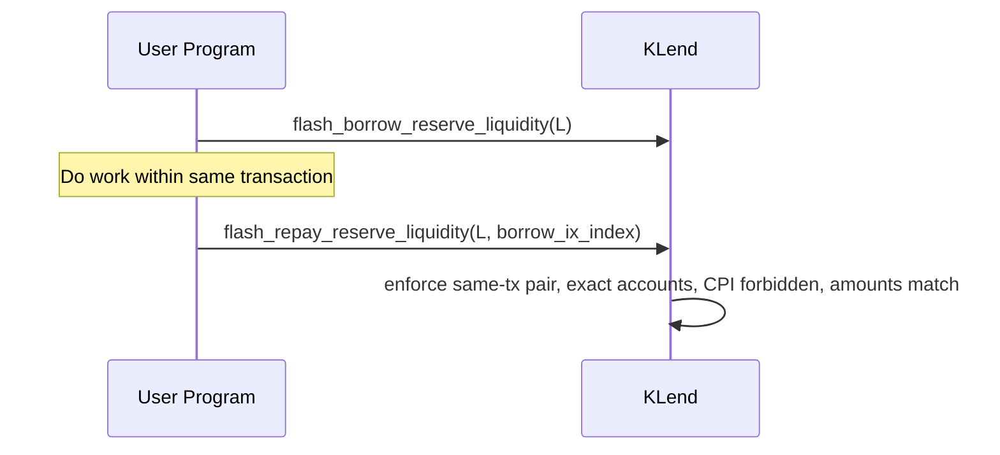

### User Flows

This document details user and system interactions across KVault, KLend, KFarms, and Scope. All flows assume pre-initialized markets and accounts.

## KVault: Deposit and Withdraw

```mermaid
sequenceDiagram
  participant U as User
  participant V as KVault
  participant L as KLend

  U->>V: deposit(max_amount)
  V->>L: refresh_reserves_batch(skip_price_updates=true)
  V->>V: charge_fees; compute AUM; shares_to_mint
  V-->>U: mint vault shares
  Note over V: Invest later via crank: Allocate to targets, handle rounding via crank funds

  U->>V: withdraw(number_of_shares [,reserve])
  V->>V: refresh reserves; charge_fees; compute AUM
  alt from available only
    V-->>U: send available tokens
  else needs disinvest
    V->>L: RedeemReserveCollateral(ctokens)
    L-->>V: liquidity
    V-->>U: tokens (net of rounding)
  end
```

## KLend: Deposit/Redeem and Borrow/Repay

```mermaid
sequenceDiagram
  participant U as User
  participant K as KLend

  U->>K: deposit_reserve_liquidity(amount)
  K->>K: check freshness; mint collateral (cTokens)
  U->>K: deposit_obligation_collateral(ctokens)

  U->>K: borrow_obligation_liquidity(amount)
  K->>K: check LTV, caps, tiers, utilization and fees; update debt
  K-->>U: tokens

  U->>K: repay_obligation_liquidity(amount)
  K->>K: accrue interest; decrease debt

  U->>K: withdraw_obligation_collateral(ctokens)
  K->>K: check LTV thresholds; burn cTokens; send liquidity
```

## KLend: Flash Loan



## KLend: Liquidation and Deleveraging

```mermaid
sequenceDiagram
  participant Liq as Liquidator
  participant K as KLend
  participant O as Obligation
  participant R as Reserve

  Liq->>K: liquidate_obligation_and_redeem(...)
  K->>K: check reason (LTV exceeded / autodeleverage / order), compute bonus
  K->>O: compute liquidatable amount; calculate settle/repay/withdraw
  K->>R: redeem collateral; transfer funds; apply protocol liquidation fee
  K-->>Liq: receives collateral/amounts
```

- Autodeleveraging flow (market-wide or individual) increases bonus over time post margin-call, capped by reserve/emode caps and diff-to-bad-debt.

## KLend: Refresh Cycles and Referral Fees

```mermaid
sequenceDiagram
  participant Bot as Keeper
  participant K as KLend

  Bot->>K: refresh_reserve
  K->>K: accrue interest; update price if provided; mark last_update

  Bot->>K: refresh_obligation
  K->>K: recompute values; enforce invariants

  K->>K: accumulate_referrer_fees (on interest accrual)
  Referrer->>K: withdraw_referrer_fees
```

## KFarms: Stake, Harvest, Unstake

```mermaid
sequenceDiagram
  participant U as User
  participant F as KFarms
  U->>F: stake(amount)
  F->>F: refresh_global_rewards
  alt warmup
    F->>F: add_pending_deposit_stake; set warmup ts
  else direct
    F->>F: add_active_stake; update tallies
  end

  U->>F: harvest(reward_index)
  F->>F: refresh reward; enforce min claim duration
  F-->>U: reward_user, treasury_fee

  U->>F: unstake(shares)
  F->>F: remove_active_stake; penalties if locked; add_pending_withdrawal
  U->>F: withdraw_unstaked_deposits()
  F-->>U: tokens after cooldown
```

## Scope: Mapping and Price Maintenance

```mermaid
sequenceDiagram
  participant Admin as Admin
  participant S as Scope
  participant K as KLend/KFarms

  Admin->>S: update_mapping(token, price_type, twap_enabled,...)
  Admin->>S: update_token_metadata / set_admin_cached / approve_admin_cached

  Keeper->>S: refresh_prices / refresh_chainlink_price / refresh_pyth_lazer_price
  S->>S: read oracle; validate staleness/confidence; update prices/twaps
  K->>S: read DatedPrice in operations (via CPI read)
```
